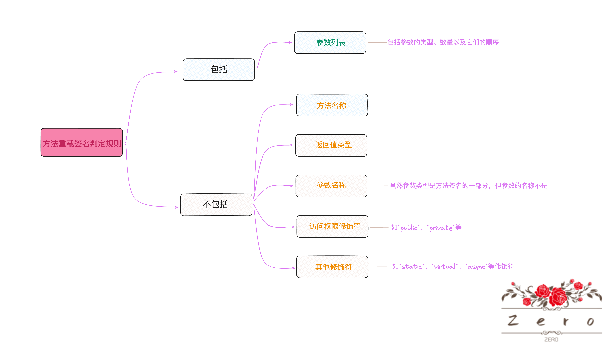
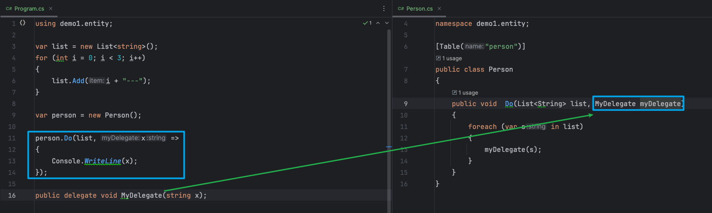
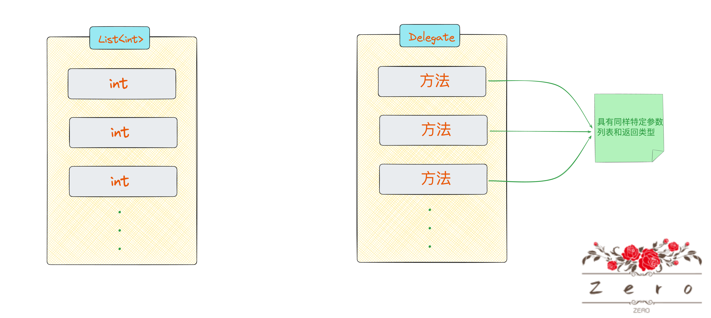

# 前置

* 这里是为了便于了解`Delegate`而需要用到的相关知识

## - 方法重载签名

* **方法重载签名一般会包含足够的信息以唯一标识一个方法**

* **其作用在于允许在一个类中进行方法重载**

* 方法重载签名的判定规则如下所示：

  


## - `Java`的函数式接口

* 为什么也会接触到跟`Java`相关的知识
* 是因为严格意义上讲我的第一门较懂编程语言是`Java`，从`Java`转过来`.NET`时，会带着之前使用`Java`的角度来理解
* 然后`C#`中的`Delegate`跟`Java`的`Functional Interface`又很相似，so前置知识中也包含了其

# 引出

* 这里先要回顾一下`Java`的函数式接口概念

* 其意思为**仅包含一个抽象方法的接口**，如下所示

  ```java
  @FunctionalInterface
  public interface DemoInterface {
      void Action(String input);
  }
  ```

* 现有使用该接口的类如下定义

  ```java
  public class Person {
      public void  Do(List<String> list, DemoInterface demoInterface){
          for (String s : list) {
              demoInterface.Action(s);
          }
      }
  ```

  * 这里要特别留意一点，对于`DemoInterface`接口，因为它也是一种类型，根据面向接口编程，所以<b style="color:red">将它可作为方法参数这是我们脑海里很普遍性的认识</b>

* 那么现在正常使用的代码如下所示

  ```java
   public static void main(String[] args) {
          List<String> list = new ArrayList<>();
          for (int i = 0; i < 3; i++) {
              list.add(i + "---");
          }
          Person person = new Person();
          person.Do(list, x -> {             // <--使用Lambda表达式来实现函数式接口的行为
              System.out.println(x);
          });
      }
  ```

* 对于一个接口类型作为`Do()`方法参数时，正常来说我们通常的操作是让一个类实现此接口，内部重写接口中的方法，然后在实际方法`Do()`调用时，通过`new`一个这个类的实例对象作为参数进行传递

* 当然，要是说这个`DemoInterface`接口下可能说会有多种实现，那么我们也得构造对应数量的子实现类，在调用时也要根据实际情况先`new`出来对象先再去传参

* 而这里能仅仅通过使用一个`Lambda`表达式（匿名函数）来替换上述相对来说这么麻烦的用法，有一个很重要的点，<b style="color:red">那就是对于`Do()`方法的`DemoInterface`类型的参数，我在此方法内部只是需要用到它那个唯一性的`Action()`方法罢了</b>
* <b style="color:red">那么现在换个角度来想，`Do()`方法的这个参数其实本质上就是想接受的是「一个方法」`Action()`用来在内部逻辑中实现一个回调操作而已</b>
* 只是，可能**受限于`Java`语言层面上的设计特性，我们无法直接传入一个方法类型给方法当做参数**
* <b style="color:red">在用法上我们需要通过加多一层`Interface`去包装这个方法的形式才行</b>，因此在`Java`语言也就诞生了函数式接口的概念，也因此可以通过`Labmda`表达式简洁地构造逻辑形成匿名函数作为参数传给方法(而无需走先创建一个类实现此接口重写接口中方法这一套传统复杂的做法)
* 这样做的好处是相当明显的
  * 这种`Lambda`表达式形成的匿名函数很简洁，可读性很强，一看就知道是啥逻辑
  * 无需走传统做法那一套复杂繁琐的流程（要实现某种逻辑还得专门生成个类才行），你要什么逻辑就写什么逻辑即可，灵活性很强
* <b style="color:red">所以，可以总结道，当函数式接口作为某个方法的参数时，其实本质上我们想要的只是函数式接口中那个唯一的方法用来在内部做回调操作摆了</b>

***

* 上面虽然只是描述到关于`Java`中的函数式接口概念和用法

* 看似跟此博客要描述的`C#`中的`Delegate`毫无关系

* 但实际上，语言层面上（不限于此）的设计是通用性的，只是换个说法罢了

  * 对于提供用来处理事件的机制，并允许程序响应这些事件，`Java`是叫事件和监听器，而`C#`是叫事件和委托
  * 比如说对于目录层级之间的分割符，`Linux OS`采用的是`/`，而`Windows OS`采用的是`\`

* **对于想在方法的参数中接受一个方法类型用来回调操作这个思想**

* **在`Java`层面他的定义是通过使用接口来封装多一层，叫做`Functional Interface`**

* 而在`C#`中，则叫`Delegate`，它的定义相对来说更加符合让方法作为方法参数类型这一思想，如下所示

  ```c#
  public delegate void MyDelegate(int x);
  ```

* 是不是很直接，很生动形象，看起来无非就是**给方法定义时加个`delegate`关键字标识**

* 它使用起来可以说跟`Java`是一摸一样的

  

  * 这与上述用`Java`编写的例子达到的效果是一毛一样的

* **`Delegate`它在作为方法参数类型时，也很直观性的符合把方法作为方法参数类型这一特征**

* 好了，`Delegate`现在已经引出来了

* <b style="color:red">现在可以简单概括道，`Delegate`就是相当于让一个方法可以作为另外一个方法的参数类型，便于进行回调操作罢了</b>

* 接下来的无非就是`Delegate`在`C#`中被设计时具有一些又稍微不一样的特征

* `Delegate`在`C#`中也是一种类型，就是说可以用一个变量来接受它

* 后续可以直接允许调用这个变量，用来执行存储在这个委托变量上的方法

# 使用


## - 定义

- 委托的定义很简单，就是只有下面这种方式

  ```c#
  public delegate void MyDelegate(int param);
  ```


## - 构造

* 委托的构造具有多种方式

* 假设现在有委托定义如下：

  ```c#
  public delegate void MyDelegate(int param);
  ```

1. 使用实例方法（**可以直接引入一个实例对象的某个成员方法**）

   ```c#
   public class MyClass
   {
       public void InstanceMethod(int param)
       {
           Console.WriteLine(param);
       }
   }
   
   MyClass obj = new MyClass();
   
   MyDelegate del = obj.InstanceMethod;    // <---
   ```

2. 使用静态方法（**可以直接引入某个静态方法**）

   ```c#
   public static void StaticMethod(int param)
   {
       Console.WriteLine(param);
   }
   
   MyDelegate del = StaticMethod;   // <---
   ```

3. 使用匿名方法

   ```c#
   MyDelegate del = delegate(int param)
   {
       Console.WriteLine(param);
   };
   ```

4. 使用`Lambda`表达式（<b style="color:green">最为常用</b>）

   ```c#
   MyDelegate del = (param) => Console.WriteLine(param);
   ```

5. 使用方法组转换

   ```c#
   public class Person
   {	
       public void Print(int number)
       {
       		Console.WriteLine(number);
       }
   
       public void Print(string message)
       {
       		Console.WriteLine(message);
       }	
   }
   
   Person person = new Person();
   MyDelegate intPrinter = person.Print;  // 方法组转换,
   ```

   * 对于`Person`类中的`Print()`方法
   * 它进行了一个**方法重载，即具有多个相同方法名称，但参数类型、个数、顺序有不同之处的方法**
   * 而方法组转换意思是说，**使用方法组转换进行委托构造时，虽然符合指定的`Print`方法名称的方法具有多个，但是，由于我们在定义`MyDelegate`时指定了参数类型个数顺序以及对应返回类型，那么它会自动映射到符合这些条件的那个具体方法上**
   * 在这里具体表现为`MyDelegate`定义时指定了只有一个`int`类型的参数以及`void`返回，那么它会映射到同样是只有一个`int`类型参数以及`void`返回的`Print`方法上


* 我们会发现委托引用的方法可以是静态方法，可以是实例方法，也可以是匿名方法
* 为什么`Deletage`可以引用不同类型的方法呢？
* 其实很简单，<b style="color:red">委托本质上其实就是一个方法引用，表示对具有特定参数列表和返回类型的方法的引用</b>
* <b style="color:red">它想要的就是你那个被引用方法内部的处理逻辑，可将任何可访问类或结构中与委托类型匹配的任何方法分配给委托</b>
* 它可不管你这个方法是什么类型


## - 区分

* 委托的区分依赖于它们的签名（它跟方法重载的签名又不太一样）
* 即，**委托所引用方法的参数类型和返回类型**
* 也就是说**即使两个委托具有相同数量的参数，但是如果参数类型或者返回值类型不同，它们也被视为不同的委托类型**
* **特别注意委托的区分与它们所引用的方法的名称无关，委托可以引用任何具有匹配签名的方法，无论方法的名称是什么**
* **在方法重载的上下文中，方法的签名不包括返回值。 但在委托的上下文中，签名包括返回值。 换句话说，方法和委托必须具有相同的返回类型**


## - 多播委托

* 多播委托它的概念上是指**它可以持有并调用多个方法的引用**

* 我们都知道对于`List<int>`这个集合，它可以装载类型为`int`的多个元素

* **多播委托也可以按照这个角度来理解，把它「想象」是一个`List<委托类型>`的集合，既然是集合，那么当然可以装载多个同类型的元素，对于这里，这个类型也就是指具有同样特定参数列表和返回类型的方法咯**

  

  * <b style="color:red">为了便于理解，是可以把它「想象」成是一个集合，但实际上委托并不是通过标准的集合类型来实现的，而是由委托的内部机制来管理的</b>

* 构造多播委托也很简单，可以使用`+`，`+=`，`-`，`-=`运算符来构造和修改多播委托

  ```c#
  MyDelegate del1 = Method1;
  MyDelegate del2 = Method2;
  
  // 使用 + 创建一个新的多播委托
  MyDelegate combinedDel = del1 + del2;
  
  // 使用 += 将方法添加到委托的调用列表中
  combinedDel += Method3;
  ```

* 注意
  * **多播委托的调用顺序是按照方法被添加到委托中的顺序依次进行的，若有参数，其传递同理**
  * **如果委托的调用列表中的某个方法抛出异常后，那么后续的方法将不会被执行**
  * **对于具有返回值的委托，多播委托的返回值将是调用列表中最后一个方法的返回值**


* 一个特殊点的例子，代码如下

  ```c#
  Person person1 = new Person();
  Person person2 = new Person();
  MyDelegate tem = person1.Do;
  tem -= person2.Do
  ```

  * 最终`tem`中存储的方法个数为1
  * 这是因为<b style="color:blue">`person1`和`person2`是不同的实例，它们的方法引用`Do`也会被视为不同，即使他们的方法签名相同</b>
  * 所以在尝试从`tem`的调用列表中移除`person2.Do`的引用时，但此时`tem`的调用列表中只有`person1.Do`的引用，所以这个操作不会有任何效果


## - 内置的委托

* 诸如在`Java`中内置了一系列常用的函数式接口，如`Comsumer<T>`、`Supplier`、`Function<T, R>`等

* `.NET`内置了许多委托类型，其中有两个最为常用的

* `Action`委托

  * 这是一个**没有返回值的委托，可以有0-16个参数**
  * 当**需要引入方法但不需要返回值**的时候，可以使用这个

  ```c#
  Action action = () => Console.WriteLine("Hello, world!");
  Action<int> actionWithParam =(x) => Console.WriteLine($"Number: {x}");  // <int>为范型参数，指明输入参数的类型
  
  action(); // output: Hello, world!
  actionWithParam(5); // output: Number: 5`
  ```

* `Func`委托

  * **这是一个有返回值的委托，同样也是可以有0-16个参数**
  * **其范型参数的最后一个就是返回值的类型**

  ```c#
  Func<int, int, int> add = (x, y) => x + y;
  Func<string> getMessage = () => "Hello, world!";
  
  int result = add(3, 4); // result = 7
  string message = getMessage(); // message = "Hello, world!"
  ```


## - 范型委托

* **在`C#`中，委托本身并不支持重载的概念，因为委托类型的名称必须是唯一的**

* 如下尝试委托重载示例中，编译器便会直接报错说定义`duplicate`

  ```c#
  public delegate int Do(int x, int a);
  public delegate void Do(int x);
  ```

* 但是**可以使用范型委托来达到类似重载的作用**

* 如下所示

  ```c#
  public delegate int Do(int x, int a);
  public delegate int Do<T>(T param1);
  public delegate void Do<T, R>(T param1, R param2);
  ```

* 这样使用起来也更加灵活，允许我们根据需要使用不同的参数列表定义，使用委托


# 注意事项

* <b style="color:red">对于委托引用的方法具有返回值时，调用委托将返回该方法执行后的返回值，如果委托是多播的，那么它将返回最后一个方法执行后的返回值</b>

  ```c#
  public delegate int Do(int x, int a);
  
  Do myDelegate = (x, y) => x + y;
  
  myDelegate += (x, y) => x * y;
  
  var i = myDelegate(1, 2);
  Console.WriteLine(i);
  
  //ouput    2
  ```

* **尽管委托可以使用`out`参数，但不建议将该委托与多播事件委托配合使用，因为我们无法知道将调用哪个委托**

* <b style="color:red">委托类型派生自`.NET`中的`Delegate`类，委托类型是密封的，对于委托类型，这意味着我们无法创建一个派生自另一个委托类型的新委托类型，而只能通过委托声明实现--这种设计是有意为之的，目的是保持委托的简单性和安全性</b>

* 委托是面向对象的、类型安全的和可靠的。

  * 委托是一种类型，委托继承自系统的`System.Delegate`类，这意味着它拥有类的所有特性，如封装、继承和多态性。

  * C#中，委托是类型安全的，意味着它们在编译时就确定了可以封装的方法的签名（包括参数类型和返回值类型）。如果尝试将一个与委托签名不匹配的方法赋给委托，编译器将报错

  * 委托的可靠性主要来自于它的类型安全性，委托还能确保方法的调用环境（如静态方法或实例方法的调用者）正确无误地保留下来，即使在将委托传递到其他组件进行异步调用时也是如此

    > 当你创建一个委托并将它指向一个方法时，委托不仅保存了方法的引用，还保存了方法调用所需的上下文信息。对于实例方法，这包括方法所属的对象实例；对于静态方法，则不需要对象实例。这使得你可以在程序的任何地方调用委托，而委托会以正确的方式执行其引用的方法，就像是在其原始上下文中执行一样。这对于异步编程尤其重要，因为它允许你在不同的执行线程中安全地调用方法，而无需担心上下文丢失。

# 参考

1. [Microsoft Document](https://learn.microsoft.com/zh-cn/dotnet/csharp/programming-guide/delegates/)
2. [C# 中的委托和事件](https://www.cnblogs.com/SkySoot/archive/2012/04/05/2433639.html)