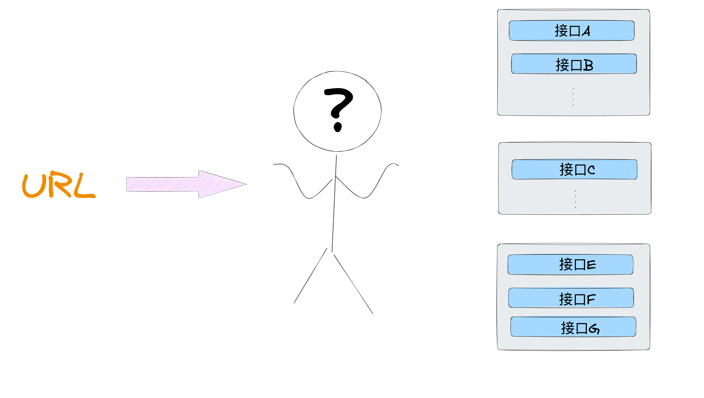
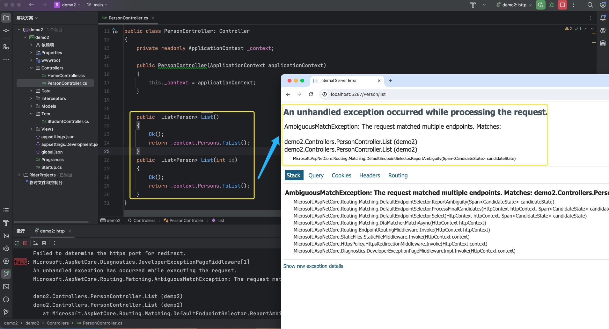
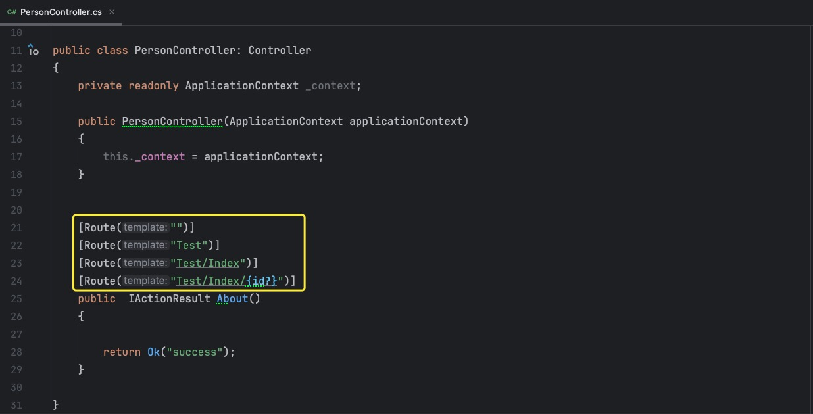

# 路由

* 路由，是<b style="color:red">指负责匹配传入的`Http`请求，然后将这些请求发送到应用的可执行终点</b>(在`MVC`项目中即指`Controller`中的方法)

  

* 而路由规则呢，则是**对于`url`如何映射`Controller`中哪个方法的配置**

* `ASP.NET Core MVC`中支持传统路由与属性路由


## 传统路由

### - 默认的

* 在`ide`中使用`ASP.NET Core MVC`模版创建项目时，会自动生成一段传统路由的配置代码，如下所示

  ```c#
  app.MapControllerRoute(
      name: "default",
      pattern: "{controller=Home}/{action=Index}/{id?}");
  
  // 或者用下面的简化方法替换
  app.MapDefaultControllerRoute();
  ```

* 之所以叫传统路由，是因为<b style="color:red">它直观性的定义了`URL`应该如何映射到控制器和动作</b>

  * 第一个路径段`{controller=Home}`：指明**映射到控制器的名称**，如果没有，则默认为`Home`控制器
  * 第二个路径段`{action=Index}`：指明**映射到操作的名称（也即是方法名称）**，如果没有，则默认为`Index`
  * 第三个路径段`{id=?}`：指明**路径参数**，其中`?`代表这个路径参数是可选的，也就是说可传可不传

* 这里要特别提到一点，在`ASP.NET Core MVC`项目中，**控制器的命名约定是`类名 + Controller`**，比如`PersonController`、`OrderController`

* 因此，上述默认的传统路由代码片段匹配`URL`情况如下所示

  * `/Person/List`：映射到`PersonController.List`操作，由于没有传路径参数值，所以此时`id`为默认值`null`
  * `/Order/Detail/3`：映射到`OrderController.Detail`操作，并将`3`绑定到路径参数`id`上
  * `/`、`/Home`、`/Home/Index`,`/Home/Index/6`这四个`URL`是等效的(因为路由模版中设置了默认的`Controller`和默认的`action`)，最终都会映射到`HomeController/Index`操作上

* 映射的几大特性：

  * `不基于命名空间`：路由到控制器的过程是基于路由模版的，不考虑控制器类所在的命名空间，因此，**不同命名空间的同名控制器会导致路由冲突**

  * `不基于源文件位置`：控制器在项目文件系统中所在的位置对路由没有影响，**路由系统只关心类名和方法名**

  * `不基于方法参数`：控制器`action`的参数数量和类型对路由映射并没有影响，**路由系统在匹配时是不会考虑方法签名的**

    * 如果在同一控制器中拥有同名但参数不同的方法，只使用传统路由的话是无法正确区分它们的，如下所示

      


* 使用传统路由的优势：
  * **简化的路由逻辑**：传统路由提供了可读性超强，易与理解的方式来定义`URL`请求映射到特定的控制器和动作
  * **保持一致性**：对于`Web`场景的开发，`URL`的结构与控制器-动作的映射往往都是对应，可预测的
  * **约定大于配置**：遵循约定大于配置的原则，在传统路由的默认映射规则下，使得在开发时无需为每个控制器动作编写详细的路由配置

***


### - 多个传统路由

* 传统路由的配置我们是可以配置多个的

* 默认的传统路由配置适用于大量场景，但有些特定的环境需要一些不一样的映射规则，

* 经典的列子是文件的获取，通常来说其请求`URL`的构成为`/files + 文件所在路径`，比如所`/file/a/b/c/test.txt`

* 要知道文件所在的目录结构层次的构成是不确定性的，理论上说可以是趋于∞

* 如果还是使用传统模式的方式来映射的，相当于文件目录结构层次有多深，我们就要写多少个与之相应的操作，这是不可能的

  

* 因此我们需要一个新的映射规则来处理这些比较特殊一点的`URL`,也就是为什么我们要配置多个路由规则的缘由

* 针对上述案例进行下面所示配置

  ```c#
  endpoints.MapControllerRoute(
      name: "fileBrowser",
      pattern: "file/{*path}",
      defaults: new { controller = "File", action = "Browse" });
  endpoints.MapControllerRoute(
      name: "default",
      pattern: "{controller=Home}/{action=Index}/{id?}");
  ```

  * 这样的话针对于所有以`/file`开头的`URL`请求，都会根据`defaults: new { controller = "File", action = "Browse" })`的配置始终映射到`FileController.Browse`操作上
  * 其中的路径参数`path`由于带上了`*`号(捕获全部参数)，所以会把该`URL`中后续的内容全部捕获（在这里就是`a/b/c/test.txt`）

* 注意：<b style="color:red">对于配置多个传统路由，越早配置的，具有更高的匹配优先级，一旦找到匹配的路由，就会直接使用该路由处理请求，后续的路由不在尝试匹配</b>

***


## 属性路由

* 属性路由机制<b style="color:red">允许直接在控制器或动作方法上使用属性来定义路由</b>
* 它的控制细粒度比传统路由更小，允许针对每个动作单独定义路由


### - 简单使用

1. 在`Startup.cs`中进行设置

   ```c#
   app.UseEndpoints(endpoints =>
           {
               endpoints.MapControllers();
           });
   ```

2. 在`Controller`中通过`[Route]`属性进行配置

   

   * <b style="color:red">属性路由支持定义多个访问同一操作的路由</b>

3. 使用，后续访问`/`、`/Test`、`/Test/Index`、`/Test/Index/3`都会映射到`PersonController.About`操作上

***


### - 标记替换

* 标记替换是属性路由的一个特性，用法是将标记用分隔符方括号`[]`括起来（可以通过重复该字符`[[`或`]]`对其进行转化）

* 它通过<b style="color:red">在定义路由时使用特定的标记，在运行时这些标记会动态的被换成相应的值</b>

* 假设有如下代码

  ```c#
  [Route("/api/[controller]")]
  public class PersonController: Controller
  {
      private readonly ApplicationContext _context;
      public PersonController(ApplicationContext applicationContext)
      {
          this._context = applicationContext;
      }
      [Route("{id}")]
      public  IActionResult About(int id)
      {
          return Ok("success");
      }
  }
  ```

  * 注意：这里用到了**组合属性路由，控制器上定义的所有路由模版均作为操作上路由模版的前缀**

  * 那么对于`About`方法，由于它位于`PersonController`下，所以`[controller]`会替换为`Person`，那么最终形成的路由是`/api/Person/{id}`

    

* 常见的标记

  * `[controller]`：这个标记**会被替换为控制类名的前缀部分(即类名去掉`Controller`后缀)**
  * `[action]`：这个标记**会被替换为方法的名称**
  * `[area]`：在`MVC`区域功能时，这个标记**会被替换为区域的名称**

***


### - `HTTP`谓词模版

* 所谓的`HTTP`谓词模版是<b style="color:red">指一系列特定于`HTTP`方法的属性，用于定义响应不同`HTTP`请求的动作方法</b>
* 这些谓词模版主要用在**结合`REST API`设计时，明确控制器动作或页面处理程序应当响应的`HTTP`方法类型（见名思其意），很少会在操作方法上使用`[Route(..)]`，因为该操作接受所有`HTTP`方法**
* 谓词模版如下所示：
  * `[HttpGet]`：`Get`请求通常用来请求获取数据
  * `[HttpPost]`：`Post`请求通常用于提交数据
  * `[HttpPut]`：`Put`请求通常用于更新数据
  * `[HttpDelete]`：`Delete`请求通常用于删除数据
  * `[HttpHead]`：`Head`请求用于获取资源的元信息
  * `[HttpPatch]`：`HttpPatch`请求通常

* 一个使用`Http`谓词模版的简单`CRUD`案例如下

  ```c#
  
  [ApiController]
  [Route("api/products")]
  public class ProductsController : Controller
  {
      // 获取所有产品
      [HttpGet]
      public IActionResult GetAllProducts()
      {
          // 模拟从数据源获取所有产品
          return Ok(products);
      }
      // 获取特定产品的详细信息
      [HttpGet("{id}")]
      public IActionResult GetProductById(int id)
      {
          // 模拟从数据源获取特定产品
          return Ok(product);
      }
      // 创建新产品
      [HttpPost]
      public IActionResult CreateProduct(Product product)
      {
          // 模拟添加产品到数据源
          return CreatedAtAction(nameof(GetProductById), new { id = product.Id }, product);
      }
      // 删除产品
      [HttpDelete("{id}")]
      public IActionResult DeleteProduct(int id)
      {
          // 模拟从数据源删除产品
          return NoContent();
      }
  }
  ```

  * 这里使用到了属性`[ApiController]`，其作用如下
    * **属性路由要求**：被`[ApiController]`修饰的控制器需要用到属性路由，这意味着必须在控制器或其动作方法上使用`[Route]`、`[HttpGet]`等属性
    * **模型状态验证**：此属性启用了自动模型状态验证，当接收到的请求模型不符合数据注解定义的校验规则时，`ASP.NET Core`会自动返回一个`400 Bad Request`响应
    * **参数来源推断**：该属性启用了对操作参数的来源判断，比如说参数类型是复杂类型时，`ASP.NET Core`会从请求体中读取数据

***


### - 一些补充

* **属性路由支持使用与传统路由相同的内联语法，用来指定可选参数、默认值和约束**

  * 可选参数：在参数后面加个`?`号，用来表示此参数可传可不传

    ```c#
    "{id?}"
    ```

  * 默认值：给参数一个默认值，若请求中携带此参数，则进行值覆盖操作

    ```c#
    "{id=3}"
    ```

  * 约束：用来限定参数的类型或值的范围(类型约束，长度约束，范围约束，正则表达式约束，自定义约束)

    ```c#
    "{id:bool}" 						// 类型约束,确保id是整数
    "{id:range(1,100)}" 		// 范围约束，确保id值是处于1-100的范围
    "{id:length(3,10)}"			// 长度约束，确保id长度为3-10
    "{id:regex(^[a-zA-Z]+$)}"// 正则表达式约束，限制id只能包含字符  
    ```

* 自定义路由属性

  1. 自定义类，并实现`IRouteTemplateProvider`接口，继承抽象类`Attribute`，并定义路由模版、顺序、和名称

     ```c#
     public class MyApiControllerAttribute : Attribute, IRouteTemplateProvider
     {
         public string Template => "api/[controller]";
         public int? Order => 2;
         public string Name { get; set; } = string.Empty;
     }
     ```

  2. 使用

     ```c#
     [ApiController]
     [MyApiController]
     public class DogController : Controller
     {
     
     
         [HttpGet("demoTest")]
         public IActionResult Demo()
         {
             return Ok("success");
         }
     }
     ```

  3. 上述案例，`/api/Dog/demoTest`的`Url`即可映射到`DogController.Demo`操作上

* **属性路由可以和传统路由配合使用**，可以根据项目实际开发灵活选择

* <b style="color:red">尽量避免使用特殊字符进行路由</b>，这些特殊字符如`#`，`?`，`&`等，可以用像`-`这些其他的安全字符来替换，或者在客户端中使用对应的库来进行编码操作

* 在属性路由中，某个`URL`匹配到多个符合规则的`endpoints`的话，会直接报错。可以通过`Order`来设置路由模式的优先级别，`Order`的值越低，路由的优先级越高（通常避免使用`Order`，这样可能致使客户端混淆不清，设计、定义清晰且互不冲突的路由模版性价比更高）
* <b style="color:red">`URL`请求映射到相应的控制器和动作时，默认情况下通常时忽略大小写差异的</b>
  * 假设现在在`PersonController`下有个方法`DetailForHome`方法，下面的`URL`都可映射到
    * `/Person/DetailForHome`
    * `/Person/detailForHome`
    * `/person/detailForHome`
    * `/Person/detailforhome`
    * `/person/detailforhome`

