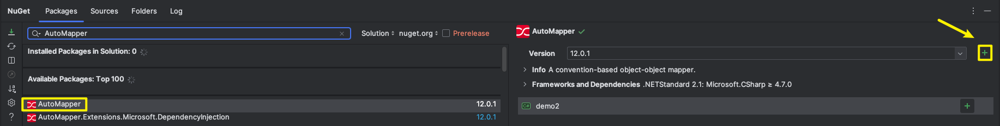

# 基概

* `AutoMapper`是一个在`.NET`应用程序中广泛使用的对象-对象映射器库
* 在分层架构中(数据访问层--业务逻辑层--表示层)，每一层的数据关注点都不太一样，从而会导致模型隔离，如何去映射上下层之间的数据转换，这就是`AutoMapper`要解决的事情
* 其旨在**将某种类型的输入对象转化为不同类型的输出对象**，减少手动编写的样板代码


# 使用

## - Demo

1. 通过`NuGet`导入`AutoMapper`包

   

2. 定义源对象类型`Product`和目标对象类型`ProductDto`

   ```c#
   public class Product
   {
       public int Id { get; set; }
       public string ProductName { get; set; }
       public string ProductDescription { get; set; }
       public double Price { get; set; }
       public string Category { get; set; }
       public int StockQuantity { get; set; }
       public bool Available { get; set; }
       public DateTime CreateAt { get; set; }
   }
   public class ProductDto
   {
       public int Id { get; set; }
       public string ProductName { get; set; }
       public string ProductDescription { get; set; }
       public double Price { get; set; }
       public string Category { get; set; }
       public int StockQuantity { get; set; }
       public bool Available { get; set; }
       public DateTime createat { get; set; }
   }
   ```

3. 通过配置构建映射规则以及实例化`IMapper`对象

   ```c#
   var config = new MapperConfiguration(cfg => cfg.CreateMap<Product, ProductDto>());
   var mapper = config.CreateMapper();
   ```

4. 使用

   ```c#
   var product = new Product()
   {
       Id=3,
       ProductName = "小明",
       ProductDescription = "这时一个测试",
       Price = 88.99,
       Category = "人类",
       StockQuantity = 100,
       Available = true,
       CreateAt = DateTime.Now
   };
   var productDto = mapper.Map<ProductDto>(product);
   ```


* ps：可通过调用`config.AssertConfigurationIsValid();`来测试映射规则是否ok，有误的话会直接报错并会指明是哪个字段映射出了问题


## - 整合

* 默认当前为`ASP.NET Core`的`MVC`项目，并整合了`Autofac`替代原有的容器

1. 通过`NuGet`导入`AutoMapper`包和`AutoMapper.Contrib.Autofac.DependencyInjection`包

2. 定义映射配置(**通常是通过创建一个或多个继承自`Profile`类的类来完成的，每个类中定义了相关映射规则**)

   ```c#
   public class ProductProfile : Profile
   {
       public ProductProfile()
       {
           CreateMap<Product, ProductDto>();
           CreateMap<ProductDto, Product>();
       }
   }
   ```

3. 注册`AutoMapper`到`Autofac`中

   ```c#
   builder.RegisterAutoMapper(typeof(ProductProfile).Assembly);
   ```

4. 在项目中使用依赖注入获取`IMapper`接口实例即可使用


# 映射


## - 前缀/后缀

* 有时候，可能在源对象或者目标对象的其中一方，其属性是带有一定的前缀/后缀

* 此时双方名称不匹配，可以通过配置来让`AutoMapper`识别出来从而简化映射

* 配置如下所示

  ```c#
  cfg.RecognizePrefixes("frm"); // 识别前缀
  cfg.RecognizePostfixes("Dto") // 识别后缀
  ```

* **默认情况下，`AutoMapper`是识别前缀`Get`的**，可通过调用方法来清除前缀

  ```c#
  cfg.ClearPrefixes();
  ```


## - 过滤字段/属性

* **默认情况下，`AutoMapper`会尝试映射每个公共字段/属性**，可以通过配置过滤器进行过滤操作

* 示例如下

  ```c#
  var configuration = new MapperConfiguration(cfg => {                          //cfg写法
  // 不匹配任何字段
  	cfg.ShouldMapField = fi => false;
  // 匹配满足一定条件的属性
  	cfg.ShouldMapProperty = pi =>
  		pi.GetMethod != null && (pi.GetMethod.IsPublic || pi.GetMethod.IsPrivate);
  });
  ```

  ```c#
  public class PersonMapping: Profile                                            // Profile写法
  {
      public PersonMapping()
      {   
          ShouldMapField = fi => false;
          ShouldMapProperty = pi =>
              pi.GetMethod != null && (pi.GetMethod.IsPublic || pi.GetMethod.IsPrivate);
          CreateMap<Product, ProductDto>();
      }
  }
  ```


## - 投影

* **当想要把源值映射到与源结构不完成匹配的目标时，我们可以通过指定自定义目标对象的成员映射定义来解决此问题**

* 举个例子，假设现在源对象结构中有一个`DateTime`类型的`Date`属性，而在目标对象结构中拆分成使用两个`int`类型的属性`Hour`,`Minute`来接受

* 此时即可通过投影操作进行映射

* 配置如下所示

  ```c3
    cfg.CreateMap<CalendarEvent, CalendarEventForm>()
  	.ForMember(dest => dest.EventDate, opt => opt.MapFrom(src => src.Date.Date))
  	.ForMember(dest => dest.EventHour, opt => opt.MapFrom(src => src.Date.Hour));
  ```

  * 在`CreateMap`后，通过调用`ForMember()`来指定两者之间如何映射
  * 其中第一个参数指明目标对象的哪个属性，第二个参数指明其值如何从源对象中映射过来


## - 嵌套映射

* 所谓嵌套是指在一个定义的类结构中，包含着类型也是为类的属性/字段
* 而在`AutoMapper`中处理这种嵌套映射极为简单
* **只需要定义所有涉及的类型之间的映射规则，`AutoMapper`将自动处理嵌套对象的映射，只要映射规则已经定义**
* 也就说多调用几次`CreateMap<A,B>()`，把嵌套的内部类型映射关系也配置就ok了


* ps：
  * **配置类型的顺序不重要**
  * **在调用`mapper.Map<TargetType>(source)`做映射时不需要指定任何内部类型，只需指定用于传入源值的类型映射**


## - 列表和数组

* **对于列表和数组的映射，`AutoMapper`关注于配置的元素类型，而不需要配置任何可能使的数组或列表类型**

* 假设现在有类型`A`和`B`，已通过`cfg.CreateMap<A,B>()`做好映射配置

* 若现在有个元素类型为`A`的数组`sources`，那么是可以直接做映射的，**只需要在做映射操作时指明目标数据/集合类型即可**

* 如下所示：

  ```c#
  IEnumerable<B> ienumerableDest = mapper.Map<IEnumerable<B>>(sources);
  ICollection<B> icollectionDest = mapper.Map<ICollection<B>>(sources);
  IList<B> ilistDest = mapper.Map<IList<B>>(sources);
  List<B> listDest = mapper.Map<List<B>>(sources);
  B[] arrayDest = mapper.Map<B[]>(sources);
  ```

* 支持的源集合类型如下：

  - `IEnumerable`
  - `IEnumerable<T>`
  - `ICollection`
  - `ICollection<T>`
  - `IList`
  - `IList<T>`
  - `List<T>`
  - `Arrays`

* ps：**如果源对象中的集合属性为 `null`，AutoMapper 在映射这个集合属性到目标对象时，会将目标对象中对应的集合属性初始化为一个空集合（比如空的 `List<T>` 或空的数组），而不是将其设置为 `null`，即认为 C# 引用、数组、列表、集合、字典和 IEnumerables 永远不应该为 `null`·，这个行为的设计初衷是为了减少在使用目标对象时需要进行 `null` 检查的场合，提高代码的健壮性。**
* 可通过设置`cfg.AllowNullCollections`的`true/false`值来更改此行为


## - 构造函数参数映射

* 全名应该叫做--**基于目标类构造参数的名称和源对象属性名称之间的匹配**

* 在某些应用场景下，需要通过构造函数进行映射
  * **目标类型的属性是只读的，只能通过构造函数进行初始化**
  * **源类型和目标类型直接的属性名称或者结构不匹配**
  * **在映射的时候想对数据进行一些额外的转化/处理**
* `AutoMapper`从版本`5.0`开始，默认开启此功能
* 可通过调用`cfg.DisableConstructorMapping()`关闭此功能


## - 反向映射

* 当执行`cfg.CreateMap<A,B>()`建立从类`A`到类`B`的映射后，

* 实际上我们可以通过继续调用`ReverseMap()`方法反向建立从类`B`到类`A`的映射

* 这就是反向映射的定义

* 所以完整的写法应该为：`cfg.CreateMap<A,B>().ReverseMap()`

* 但是有时候源类和目标类的结构不一定一致，这时候我们需要通过调用`ForMember()`方法来自定义映射逻辑，如下所示

  ```c#
  cfg.CreateMap<Order, OrderDto>()
    .ForMember(d => d.CustomerName, opt => opt.MapFrom(src => src.Customer.Name))
    .ReverseMap()    // 因为设置反向映射，所以还要做一遍反向映射时的逻辑
    .ForPath(s => s.Customer.Name, opt => opt.MapFrom(src => src.CustomerName));
  ```


## - 条件映射

* 条件映射允许我们**基于特定条件来决定是否应执行特定属性的映射**

* 这对于我们只希望在满足某些条件时才映射这些属性，或者根据源对象的状态来改变映射行为时非常有用

* 使用起来也很方便，在做映射配置调用`ForMember`方法时通过`Condition`方法来指定一个`Labmda`表达式去配置条件

* 例子

  ```c#
  var configuration = new MapperConfiguration(cfg => {
    cfg.CreateMap<Foo,Bar>()
      .ForMember(dest => dest.baz, opt => opt.Condition(src => (src.Number >= 0)));   // 当源对象的Number值>=0时才做映射
  });
  ```

* 类似的，`PreCondition`也可以在映射执行之前对源对象进行检查，以决定是否应该执行固定的映射规则
* **`PreCondition`在映射规则执行之前进行评估，而`Condition`是在已经决定要执行映射规则之后，实际设置目标属性之前进行评估**


## - 继承映射

* `AutoMapper`**允许我们在映射配置中利用已有的映射规则作为基础，并在此基础上扩展或修改，以使用更具体的映射需求（复用映射规则）**

* 通过调用`Include()`、`InclueAllDerived()`或者`IncludeBase()`方法来实现此功能(假设现在`Teacher`继承`Person`,`TeacherDto`继承`PersonDto`)

  ```c#
  cfg.CreateMap<Person, PersonDto>();
  cfg.CreateMap<Teacher, TeacherDto>().IncludeBase<Person, PersonDto>();
  // 或者
  cfg.CreateMap<Person, PersonDto>().IncludeBase<Teacher, TeacherDto>();
  // 又或者  如果基类有许多派生类，可以直接通过调用InclueAllDerived()方法一步到位
  cfg.CreateMap<Person,PersonDto>().InclueAllDerived(); 
  ```

* 当使用继承映射时，存在一个优先级顺序

  1. 显示映射规则：**直接为特定的源类型和目标类型定义的映射规则具有最好优先级**
  2. 继承的映射规则：**如果没有找到显示映射规则，后续会查询是否有任何基类或派生类的映射规则可以用（它会尝试找到“最近”的可用映射规则来应用）**
  3. 约定映射：上述二者都无规则可用时，**最后默认按照名称约定进行映射**


## - 空替换

* 所谓空替换是指**对于源对象的某个属性值为`null`时，可以通过配置一个替代值映射到目标对象的对应属性**

* 使用时调用`NullSubstitute()`即可

  ```c#
  new MapperConfiguration(cfg => cfg.CreateMap<Source, Dest>()
      .ForMember(destination => destination.Value, opt => opt.NullSubstitute("Other Value")));
  ```

  

# 配置

## - 配置位置

* 在`Autofac`整合了`AutoMapper`的项目中，直接在继承了`Profile`的自定义类中配置即可(通常都是基于这种方式去配置)

  ```c#
  public class ProductProfile : Profile
  {
      public ProductProfile()
      {
          CreateMap<Product, ProductDto>();
          CreateMap<ProductDto, Product>();
      }
  }
  ```

* 在纯使用`AutoMapper`的项目中，在构造`MapperConfiguration`时其参数中配置即可

  ```c#
  var config = new MapperConfiguration(cfg => {
      cfg.CreateMap<Foo, Bar>();
  });
  ```

  * 继承自`Profile`的自定义配置文件可以通过多个方式添加到主映射配置中

    * 直接添加

      ```c#
      cfg.AddProfile<OrganizationProfile>();
      cfg.AddProfile(new OrganizationProfile());  // new 后再加
      ```

    * 自动扫描（会寻找继承自`Profile`的配置类和基于属性的映射）

      ```c#
      cfg.AddMaps(配置文件所在Assembly);
      cfg.AddMaps(typeof(Product), typeof(ProductDto)))
      ```

      

* **ps：不管是在哪里配置，`MapperConfiguration`实例在创建后是不可变的，即一旦定义了配置，这个配置就不能被修改了(确保映射配置的线程安全和一致性)**


## - 配置作用域

* 全局生效
  * 单纯通过`var configuration = new MapperConfiguration(cfg => { }`，然后根据`cfg来配置的话`
  * 并且不碰任何继承自`Profile`类的配置文件
  * 此时的配置是全局作用的
  * 也就是说你设置的配置规则是针对所有映射的
* 局部生效
  * 用到继承自`Profile`类的配置文件
  * 不管是通过`var configuration = new MapperConfiguration(cfg => {cfg.addProfile(xxx)}`,`来配置
  * 还是在整合了`Autofac`的项目中直接通过`builder.RegisterAutoMapper(typeof(ProductProfile).Assembly);`来配置
  * 此时的配置文件的作用域只针对于你所在配置文件中的配置
  * 也就是说此时每个配置文件都有属于自己的配置，互不影响


## - 命名约定

* 对于源对象和目标对象，由于它们处于不同层的关系，可能会采用不同的命名策略

* 而命名约定的作用就在于**能够自动识别并映射那些名称相似但格式不完全相同的属性**

* 比如说源对象的某个属性为了与数据库表字段匹配，采用小写+下划线的写法，`product_name`，而目标对象对应属性采用大驼峰命名规则，`ProductName`

* 此时即可通过配置，设置源对象所在类和目标对象所在类的命名策略从而简化映射

* 常见的命名约定如下：

  * `PascalCaseNamingConvention`：大驼峰命名规则

    每个单词都首字母大写，单词之间没有分隔符，如`ProductName`，这也是`c#`常用的命名约定

  * `CamelCaseNamingConvention`：小驼峰命名规则

    第一个单词首字母小写，之后的每个单词的首字母大写，单词之间没有分隔符，如`productName`

  * `LowerUnderscoreNamingConvention`：

    全部单词都采用小写，并用`_`分割，如`product_name`，这种写法常用语数据库字段命名

  * `UpperUnderscoreNamingConvention`：

    全部单词都采用大写，并用`_`分割，如`PRODUCT_NAME`，常用于常量的命名

* 若有需求，按如下配置

  ```c#
  var configuration = new MapperConfiguration(cfg => {
    cfg.SourceMemberNamingConvention = LowerUnderscoreNamingConvention.Instance;
    cfg.DestinationMemberNamingConvention = PascalCaseNamingConvention.Instance;
  });
  ```

  ```c#
  // 或者
  public class MyProfile : Profile
  {
      public MyProfile()
      {
          SourceMemberNamingConvention = new PascalCaseNamingConvention();
          DestinationMemberNamingConvention = new CamelCaseNamingConvention();
          // 定义映射规则...
      }
  }
  ```

  * **通过`new MapperConfiguration(cfg=>{})`这种形式做的配置是全局生效的**
  * **而采用`Profile`文件做配置这种形式时，每个继承自`Profile`的类都可以有自己的命名约定配置，这些配置是独立的，仅适用于在该`Profile`类中定义的映射规则**
  * 如果想采用`Profile`文件做配置时能够全局生效，可以先构建一个继承`Profile`的基类`A`，在其做对应配置，然后后续自定义的配置文件都统一去继承这个类`A`即可


# 扩展


## - 自定义类型转换器

* 若是我们想完全控制一种类型到另一种类型的转化，我们是可以通过自定义类型转化器来完全实现这个转化逻辑的控制的

* `AutoMapper`提供了几个形式来实现：

  * `Func<TSource, TDestination> mappingFunction`

    * 对于简单的转换逻辑，可直接通过在映射配置时调用`ConvertUsing`方法配合`Labmda`表达式来使用

      ```c#
      cfg.CreateMap<SourceType, DestinationType>()
         .ConvertUsing(src => new DestinationType
         {
             // 使用 Lambda 表达式定义转换逻辑
         });
      ```

  * `ITypeConverter<TSource, TDestination> converter`

    * 这是创建自定义类型转换器最直接的方法

    * 只需创建一个类，实现此接口，并重写`Convert`方法的转化逻辑即可，如下所示

      ```c#
      public class CustomTypeConverter : ITypeConverter<SourceType, DestinationType>
      {
          public DestinationType Convert(SourceType source, DestinationType destination, ResolutionContext context)
          {
              // 自定义转换逻辑
          }
      }
      ```

    * 最后在映射配置中调用`ConverUsing`方法来指定我们的自定义转换器即可

      ```c#
      cof.CreateMapping(SourceType,DestinationType).ConvertUsing<CustomTypeConverter>();
      ```


## - 自定义值解析器

* 自定义值解析器允许我们**为特定的成员映射定义复杂的解析逻辑**

* 当标准映射操作无法满足我们需求时，可以通过自定义值解析器来处理更复杂的数据转换和逻辑

* `AutoMapper`提供了`IValueResolver<TSource,TDestination,TDestMember>`接口来供我们实现自定义值解析器

* 其中`TSource`是源类型，`TDestination`是目标类型，`TDestMember`是目标成员类型

* 使用：

  1. 构造一个实现了此接口的类，并构造解析逻辑

     ```c#
     public class CustomValueResolver : IValueResolver<SourceType, DestinationType, DestMemberType>
     {
         public DestMemberType Resolve(SourceType source, DestinationType destination, DestMemberType destMember, ResolutionContext context)
         {
             // 自定义解析逻辑
             return resolvedValue;
         }
     }
     ```

  2. 在映射配置时，通过调用`ForMember`方法用来指定对特定成员使用自定义值解析器

     ```c#
     cfg.CreateMap<SourceType, DestinationType>().ForMember(dest => dest.SomeMember, opt => opt.MapFrom<CustomValueResolver>());
     // 或
     cfg.CreateMap<SourceType, DestinationType>().ForMember(dest => dest.SomeMember, opt => opt.MapFrom<typeof(CustomValueResolver>());
     // 或
     cfg.CreateMap<SourceType, DestinationType>().ForMember(dest => dest.SomeMember, opt => opt.MapFrom(new CustomValueResolver());
     ```


* p s：

  * **使用自定义值解析器时，解析器返回的值并不是直接赋给目标属性的**

  * **相反，`AutoMapper`会对这个返回值应用所有相关的映射规则（如果有的话）**

  * **最后才将处理后的结果设置为目标属性的值**

    > 举个例子，假设现在解析器返回的值是一个`string`,值为`test`，
    >
    > 返回这个值后`AutoMapper`会先检查你有没有配置`string`到某个类型的映射规则
    >
    > 若现在存在一个映射规则`cfg.CreateMap(stirng,string).ConvertUsing(s=>s+="demo")`
    >
    > 那么此时会先走这个映射逻辑，值变成了`testdemo`，然后最终才将这个值赋给目标属性

# 注意事项

* **将源对象映射到目标对象时，`AutoMapper`将会忽略空引用异常**

* **映射默认情况下是忽略大小写的**