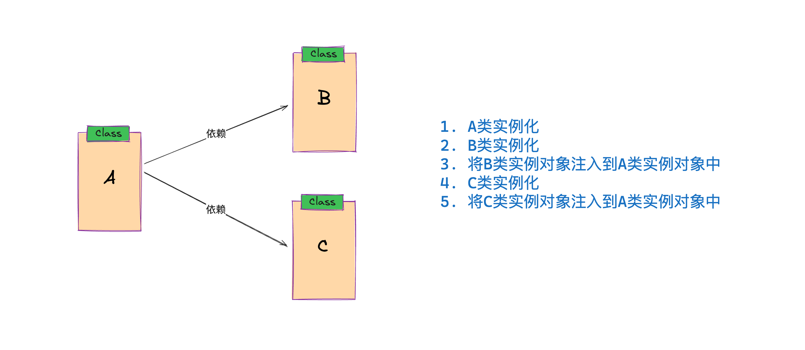
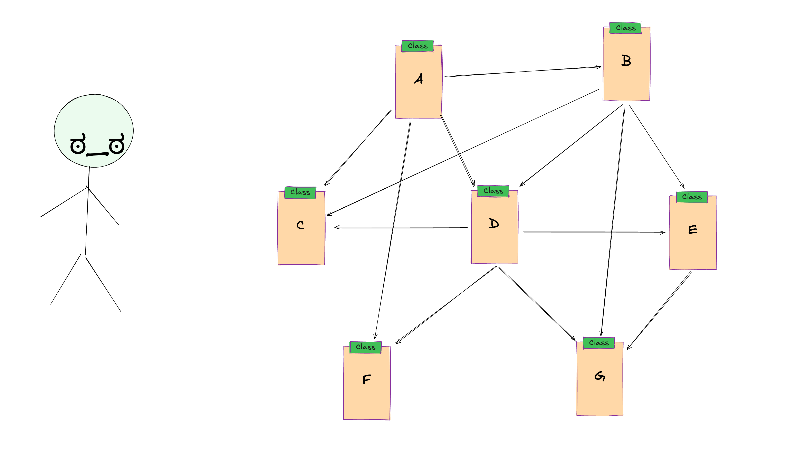
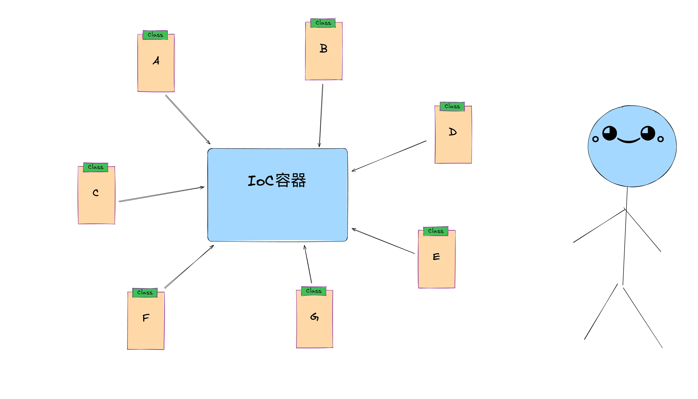
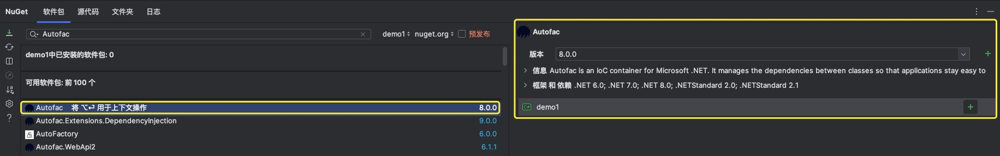
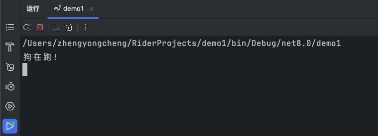
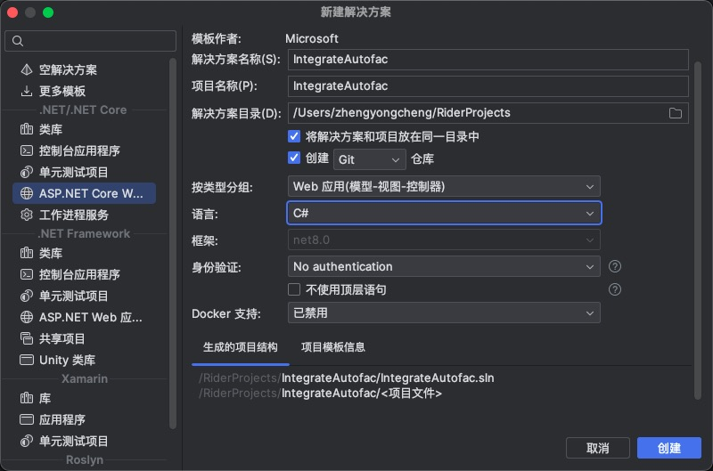
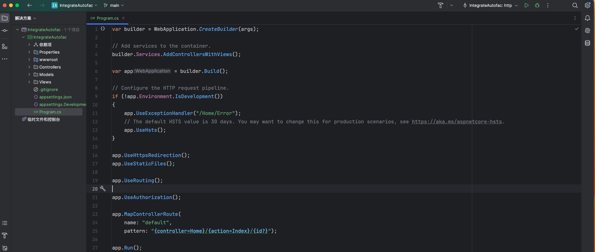
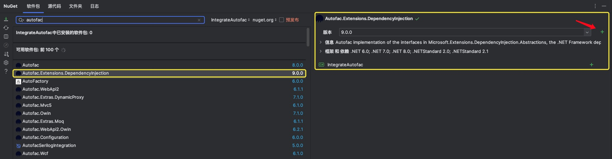
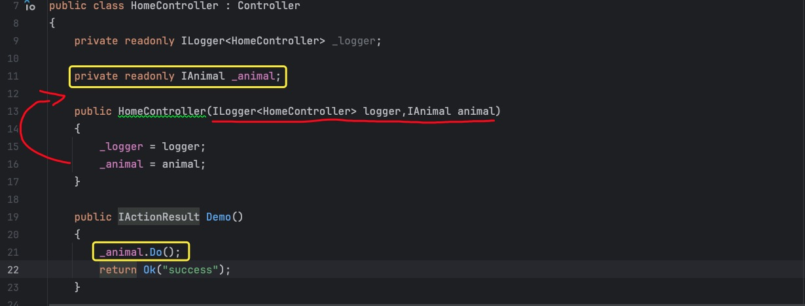
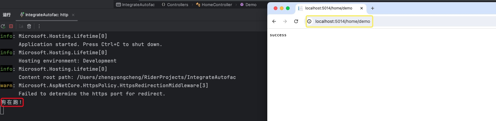

# IoC

## - 基础概念及推导

* `Inversion of Control`(缩写为`IoC`)，中文名为控制反转，它是面向对象编程中的一种设计原则

* 面向对象编程的一个很重要的点就是万物皆对象，而<b style="color:red">对象为了实现具有某种功能，常常依赖于其他的对象来一起合作实现</b>

* 

* 如上图描述，类A需要依赖于类B和类C，在传统的开发模式中，我们的实现方式都是在程序中显示地手动通过`new`去创建管理依赖对象

* 但是要知道当项目越来越大，我们定义的类也会越来越多，那么类与类之间的引用数量也会呈现一个高度增长关系

  

* 那为啥不继续按照传统方式实现下去呢？

  * 要知道实际上投入稍多的人力、时间资源，磨也能磨成这个问题
  * 但是也要知道这是一个讲究效率的时代，特别对于计算机这个行业来说，迭代性特别快
  * 对于开发来说，重点在于设计、业务、性能这些重点实现，凡事均分轻重，特别是在有限的资源分配下
  * 资源投入相较于回报值差距太多，想都不用想，直接out

* 该如何解决？

  * 这里不得不提到个人对于计算机行业的认识，<b style="color:red">当碰到某个问题，基本都会选择通过加多一层来解决-.-</b>
  * 为了能够跨平台，`JDK`在`Java`与不同操作系统承担一个桥梁作用
  * 为了能够夸语言，`.net`出来了
  * 为了提高数据访问速度，在数据存储和数据处理之间引用了缓存层
  * <b style="color:red">o.0,如果实在不行就再多加一层</b>

* 因此，为了解决类与类之间复杂的引用关系，就加多了一层，而这一层就是`IoC`

* `IoC`专门有一个容器来帮忙创建以及注入依赖对象，类的使用者只负责使用，而不负责维护，专业的事情交给专业的来做，把控制权从原来的应用程序转移到了`IoC`容器中，这也就是控制反转的由来

  


## - DI

* `Dependency Injection`(缩写为`DI`),中文名称为依赖注入，它是实现`IoC`的一个实现技术
* 其作用是由容器动态的将某个依赖关系注入到组件中
* "依赖"是指接收方所需要的对象，"注入"是指将依赖传递给接收方的过程（wiki）
  * 在编程语言中，"接收方"为对象和`class`，"依赖"为变量
  * 在提供服务的角度下看，"接收方"为客户端，"依赖"为服务
* `DI`的实现方式
  * 基于构造函数：实现特定参数的构造函数，在新建对象时传入所依赖类型的对象
  * 基于`set`方法：实现特定属性的`public   set`方法，通过外部容器调用传入所依赖类型的对象
  * 基于接口：依赖的接口提供给一个注入器方法，该方法会把依赖注入到任意一个传给它的客户。客户端实现一个`setter` 接口可设置依赖	

# Autofac

* `Autofac`是一个用于`.net`应用程序的`IoC`容器。它管理类之间的依赖关系，以便**应用程序随着规模和复杂性的增长而轻松更改**

* [官方](https://autofac.readthedocs.io/en/stable/index.html)


## - 上手Demo

1. 在项目中通过`NuGet`引入`Autofac`依赖包

   

2. 自定义接口`IAnnimal`以及其派生类`Dog`

   ```c#
   public interface IAnimal
   {
       void Do();
   }
   
   public class Dog : IAnimal
   {
       public void Do()
       {
           Console.WriteLine("狗在跑！");
       }
   }
   ```

3. 在`Program.cs`文件中构建容器并使用(使用顶级语句)

   ```c#
   // Autofac
   //  1. 构建容器builder
   var builder = new ContainerBuilder();
   //  2. 注册组件、服务等
   builder.RegisterType<Dog>().As<IAnimal>();
   //  3. 构建容器
   var container = builder.Build();
   //  4. 使用
   using (var scope = container.BeginLifetimeScope())
   {
       var animal = scope.Resolve<IAnimal>();
       animal.Do();
   }
   ```

4. 运行效果

   


* ps：**在`Spring`框架中，用`Bean`来统称那些被容器管理的对象，而在`Autofac`中，则用组件来描述。**


## - ASP.NET Core 整合 Autofac

1. 根据`ide`模版搭建`Asp.net core MVC`环境

   

2. 项目搭建完后如下所示

   

3. 通过`NuGet`引入`Autofac.Extensions.DependencyInjection`依赖包

   

   * <b style="color:red">注意，整合时要的是`Autofac.Extensions.DependencyInjection`包，而不是`Autofac`包</b>

4. 准备`Startup`配置类--**这个模版写法基本是固定的**

   ```c#
   public class Startup
   {
       public Startup(IConfiguration configuration)
       {
           Configuration = configuration;
       }
   
       public IConfiguration Configuration { get; }
   
       // 配置应用程序的服务
       public void ConfigureServices(IServiceCollection services)
       {
           services.AddControllersWithViews();
   
           // 配置数据库上下文
           // services.AddDbContext<ApplicationDbContext>(options =>
           //     options.UseSqlServer(Configuration.GetConnectionString("DefaultConnection")));
   
           // 配置其他服务...
       }
       // 配置应用程序的请求处理管道
       public void Configure(IApplicationBuilder app, IWebHostEnvironment env)
       {
           if (env.IsDevelopment())
           {
               app.UseDeveloperExceptionPage();
               // app.UseMigrationsEndPoint();
           }
           else
           {
               app.UseExceptionHandler("/Home/Error");
               app.UseHsts();
           }
           app.UseHttpsRedirection();
           app.UseStaticFiles();
           app.UseRouting();
           app.UseAuthorization();
           app.UseEndpoints(endpoints =>
           {
               endpoints.MapControllerRoute(
                   name: "default",
                   pattern: "{controller=Home}/{action=Index}/{id?}");
           });
       }
   }
   ```

5. 在`Program.cs`文件中编写启动入口（并像容器注册组件--Dog）

   ```c#
   using Autofac;
   using Autofac.Extensions.DependencyInjection;
   
   var host = Host.CreateDefaultBuilder(args)
       .ConfigureWebHostDefaults(webBuilder =>
       {
           webBuilder.UseStartup<Startup>();
       })
       .UseServiceProviderFactory(new AutofacServiceProviderFactory()) // 使用Autofac替换原有的DI
       .ConfigureContainer<ContainerBuilder>(builder =>
       {
           // 在这里注册服务、组件
           builder.RegisterType<Dog>().As<IAnimal>();
           // 可以在这里继续注册其他服务...
           
       })
       .Build();
   
   host.Run();
   ```

6. 在`HelloContoller`中引入我们的组件，并使用

   

7. 整合完毕，启动项目，访问该接口，可以正常使用`_animal`对象

   


## - 实例范围-常用的

* 所谓实例范围，是指注册组件时定义的组件的生命周期


* `Single Instance`-单实例：

  * **整个应用程序中只创建一个实例**，从根作用域和所有嵌套作用域中的所有请求都返回这一个实例重复使用（**适用于那些在应用程序中需要全局共享的、无状态的组件**，如数据库连接池管理、缓存管理等等）

    ```c#
    builder.RegisterType<MyService>().As<IMyService>().SingleInstance();
    ```

* `Instance Per Dependecny`-每次依赖实例：

  * 与单实例可以说是相反的，**每次请求都会创建一个新的实例返回**，这也是**默认的实例范围**（适**用于短暂、无状态的组件**，并且它们之间相互独立）

    ```c#
    builder.RegisterType<MyService>().As<IMyService>().InstancePerDependency();
    ```

* `Instance Per Lifetime Scope`-每个生命周期的实例

  * 在同一个生命周期范围内（通常是一个请求），获取到该组件的实例是唯一的（**适用于需要在同一个请求生命周期内共享状态的组件**，比如说用户身份认证）--类似`Spring`框架中的`request`域

    ```c#
    builder.RegisterType<MyService>().As<IMyService>().InstancePerLifetimeScope();
    ```

* `InstancePerOwned`

  * 这个比较特殊，它的作用相当于确保服务A的生命周期与`Owned<T>`所包装的对象(比如说类型B)的生命周期相匹配

  * 具体而言，当在某个作用域内使用`Owned<T>`创建实例b时，组件a将会与该实例共享相同的生命周期

  * 当实例b被释放时，实例a的生命周期也会相应地结束，确保资源正确释放

    