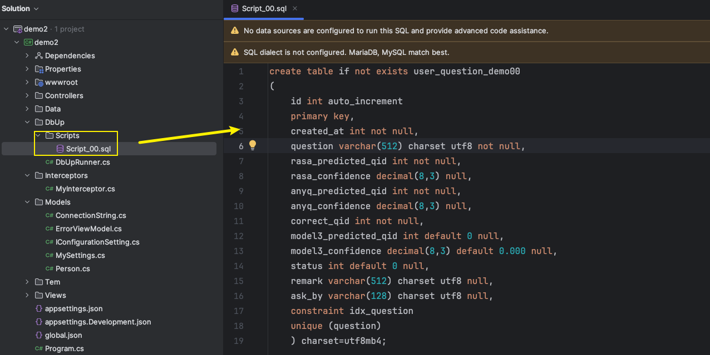
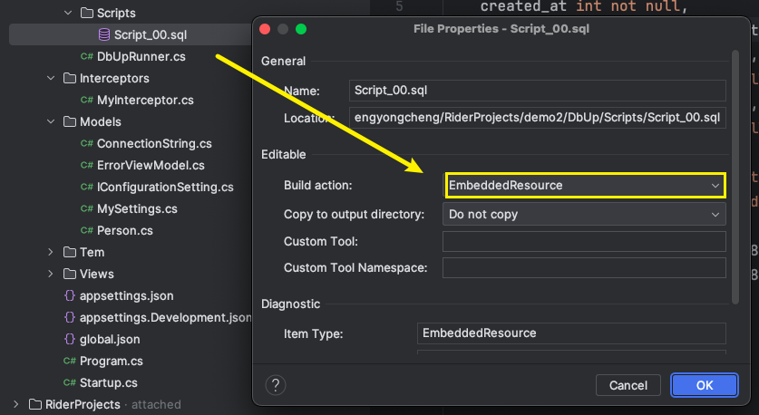
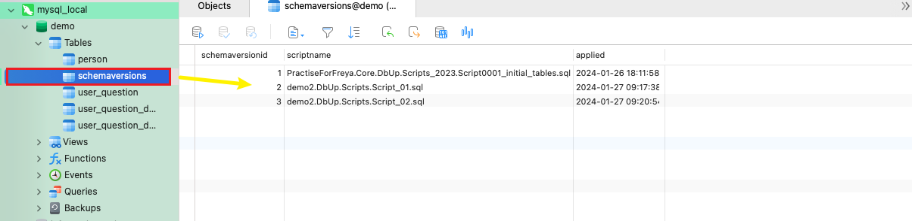

# 基概

* `DbUp`是一个流行的`.Net`库，**用于帮助管理数据库的版本和数据迁移**
* 其应用场景在于，随着程序的更新迭代，数据库中也会有需求去说修改数据库结构，比如说修改旧表中的字段，添加新表操作等等
* 相较于传统式使用人工操作进行数据库迁移的管理，使用`DbUp`它自动执行数据库迁移脚本，减少人工操作的需要，同时也减少人工犯错的概率，并且`DbUp`在执行过程中若发现错误，就会停止执行，还支持回滚操作，尽量避免来对数据库的影响
* 其有如下特性
  * 简单的迁移管理：`DbUp`只需通过一些配置即可实现自动执行`SQL`脚本，让数据迁移变得简易方便
  * 适用性：`DbUP`支持`MySQL`、`SQL Server`、`Oracle`、`PostgreSQL`等常用数据库
  * 脚本部署灵活性：对于脚本来源的加载，`DbUp`支持嵌入的资源，文件系统以及在代码中直接指明
  * 追踪已执行的脚本：`DbUp`通过在数据库中维护一个特殊的表来记录已执行过的脚本，用以保证已经执行过的脚本不会重复第二遍加载
  * 易于使用和集成：`DbUp`的整体使用是非常简易的，并且也可以快速集成到任意的`.NET`项目中
  * 可扩展性：提供了一些接口可以让开发者自定义实现以满足特定需求


# 使用步骤

1. 在项目配置文件中(如`appsettings.json`)配置对应数据源连接信息(案例以使用`MySQL`作为数据源)

   ```json
   {
     "ConnectionStrings": {
       "Default": "Server=localhost;Database=demo;User=root;Password=123456;"
     }
   }
   ```

2. 通过`NuGet`安装`dbup-mysql`包

   

   * 如果专用于某种数据库，导入的包名就是`dbup-` + 对应的数据库名
   * 如果项目是用到多种数据库的，可以通过`dbup-数据库名`依次导入各个数据库对应包，也可以通过直接导入`dbup`包这一个即可

3. 新建一个`Scripts`目录，用于专门存放脚本

   

4. **把脚本的属性设置为嵌入资源**

   

   * **此案例使用的是将脚本作为嵌套资源读取到`DbUp`里，所以这个步骤是必要的，如果是采用的是代码方式或者通过文件系统来作为脚本来源，则无需此操作**

5. 编写`DbUp`的启动逻辑(这里把它封装到一个类里面了)

   ```c#
   public class DbUpRunner
   {
      // 用于接受数据库的连接信息   Server=localhost;Database=demo;User=root;Password=123456;
       private readonly string _connectString;
       public DbUpRunner(string connectString)
       {
           _connectString = connectString;
       }
       public void Run()
       {
         	// 确保数据库存在
           EnsureDatabase.For.MySqlDatabase(_connectString);
         	// 相关配置 
           var upgradeEngine = DeployChanges.To.MySqlDatabase(_connectString)
               .WithScriptsEmbeddedInAssembly(Assembly.GetExecutingAssembly())
               .WithoutTransaction()
               .LogToAutodetectedLog()
               .LogToConsole()
               .Build();
         	// 执行操作
           var result = upgradeEngine.PerformUpgrade();
           if (!result.Successful) throw result.Error;
           Console.ForegroundColor = ConsoleColor.Green;
           Console.WriteLine("Success");
           Console.ResetColor();
       }
   }
   ```

6. 编写启动入口即可正常使用

   ```c#
   var configuration = new ConfigurationBuilder()
                       .AddJsonFile("appsettings.json")
                       .AddEnvironmentVariables()
                       .Build();		
   new DbUpRunner(configuration.GetConnectionString("Default")).Run();
   ```

   

# 脚本提供机制

* 简单来说就是`DbUp`要知道脚本文件是从哪个方式中获取到

## - Embedded Script Provider

* 所谓嵌入式是指**数据库迁移脚本作为资源嵌入到程序集中，`DbUp`会从`.NET`程序集的资源中加载`SQL`脚本**
* 其中一个重要步骤就是**要把脚本文件其属性设置为`EmbeddedResource`**
* 在使用`DbUp`时，通过调用`WithScriptsEmbeddedInAssembly()`方法来加载这些嵌入的脚本

* 用法：

  * 查找嵌入在单个程序集的脚本

    ```c#
    builder.WithScriptsEmbeddedInAssembly(Assembly, [optional filter])
    ```

    * 其中`[optional filter]`是可选参数，用于指定匹配脚本的筛选器

  * 查找嵌入在一个/多个程序集的脚本

    ```c#
    builder.WithScriptsEmbeddedInAssemblies(Assembly[], [optional filter])
    ```


## - File System Script Provider

* 文件系统见名思义，它的机制是直接**从磁盘上的文件系统中加载`SQL`脚本文件来执行数据库迁移**
* 相较于嵌入式的，文件系统可以让我们直接在文件系统中编辑，无需重新编译应用程序，并且可以将这些脚本文件作为一个独立的项目纳入到版本控制系统中与应用程序代码进行分离，便于模块式管理

* 用法：

  * 从指定路径中读取具有扩展名`.sql`的所有脚本文件

    ```c#
    builder.WithScriptsFromFileSystem(path)
    ```

  * 从指定路径中读取具有扩展名的所有脚本文件，并通过筛选器过滤(如脚本文件需以`Script`开头)

    ```c#
    builder.WithScriptsFromFileSystem(path, s => s.StartsWith("Script"))
    ```

  * 从指定路径中读取具有扩展名`.sql`并具有指定编码格式的所有脚本文件(如文件编码为`UTF-8`)

    ```c#
    builder.WithScriptsFromFileSystem(path, Encoding.UTF8)
    ```

  * 从指定路径中读取具有扩展名`.sql`并具有指定编码格式的所有脚本文件,并用筛选器过滤(如文件编码为`UTF-8`,脚本文件需以`Script`开头)

    ```c#
    builder.WithScriptsFromFileSystem(path, s => s.StartsWith("Script"), Encoding.UTF8)
    ```

  * 也可以自定义规则

    ```c#
    var options = new FileSystemScriptOptions
    {
      // 是否递归到子目录
      IncludeSubDirectories = true,
      // 指定脚本文件的扩展名(通配符模式)
      Extensions = new [] { "*.sql" },
      // 指定脚本文件编码格式
      Encoding = Encoding.UTF8,
      // 筛选规则
      Filter = path => path.Contains("value")
    }
    
    builder.WithScriptsFromFileSystem(path, options);
    ```


* 使用`File System Script Provider`时，**需确保应用程序具有指定脚本文件夹的权限**
* **`DbUp`默认是按照文件名排序来依次执行脚本，所以需确保文件的命名反映了我们希望执行的顺序**


## - Static Script Provider

* 这是**一种允许我们直接在代码中定义`SQL`脚本的方式**

* 适用于简单的数据库更改或小型项目

* 用法示例如下：

  ```c#
  var upgrader = DeployChanges.To
      .SqlDatabase(connectionString)
      .WithScripts(new[]
      {
        	// 定义脚本
          new SqlScript("ScriptName1", "CREATE TABLE MyTable (Id INT)"),        
          new SqlScript("ScriptName2", "INSERT INTO MyTable (Id) VALUES (1)")
      })
      .LogToConsole()
      .Build();
  ```


# 事务

* 从`DbUp`3.0版本开始，新增了对事务的支持
* **但并非所有数据库操作都能在所有数据库系统上完全依赖事务回滚，但除`MySQL`之外的数据库上的许多`DDL`和数据更改操作，事务都支持的很好**


* 用法：

  * 不开启事务

    ```c#
    builder.WithoutTransaction();
    ```

  * **单脚本事务（对于每个脚本都开启对应的事务，如果脚本执行失败，则只有对应脚本的更改会被回滚）**

    ```c#
    builder.WithTransactionPerScript();
    ```

  * **多脚本事务(多个脚本在同一事务中执行，任意脚本的执行失败，都会导致整个事务进行回滚，包含之前在同一事务中成功执行的脚本)**

    ```c#
    builder.WithTransaction()
    ```


# 日志

* `DbUp`内部有一个简单的日志记录抽象`IUpgradeLog`接口，并提供了几个开箱即用的记录器


* `AutodetectUpgradeLog`
  * 使用`LibLog`根据当前的环境和配置自动选择合适的日志框架
  * 它自动检测`Serilog`、`NLog`、`Log4net`、`EnLib`、`Loupe`
  * 用法：`builder.LogToAutodetectedLog()`
* `ConsoleUpgradeLog`
  * 将日志输出到`Console.write*`
  * 用法：`builder.LogToConsole()`
* `TranceUpgradeLog`
  * 将日志输出到`Trace.write*`
  * 用法：`builder.LogToTrance()`
* `NoOpUpgradeLog`
  * 丢弃所有日志，不做日志记录
  * 用法：`builder.LogToNowhere()`
* 使用自定义记录器
  * 自定义一个实现`IUpgradeLog`接口的记录器
  * 用法：`builder.LogTo(自定义日志记录器实例)`


#  注意事项

* 在示例代码中的`EnsureDatabase.For.MySqlDatabase(_connectString);`

  * 其作用在于**确保指定的数据库存在**
  * 如果数据库不存在，这个方法会尝试创建数据库（**这个方法是在执行任何脚本之前进行的，以确保数据库迁移脚本有一个已经存在的数据库可以允许运行**）
  * 这个功能在自动化数据库迁移和部署过程中非常有用，特别是在新环境或CI/CD流程中

* `DbUp`保证脚本不会被重复执行的原理

  1. 在于它会在目标数据库中维护一张特殊的表

  2. 通常称为**日志表**或**版本表**，表名为`schemaversions`，如下所示

     

  3. 当我们修改了一个已经执行过的脚本`Script_01.sql`，后续再重新运行`DbUp`时，它是不会重新执行这个脚本的

  4. 缘由是其**`schemaversions`表会追加记录用来跟踪哪些脚本已经执行过**

  5. 所以脚本文件是`DbUp`用来区分是否执行的最小单位

  6. **so对于每次的数据迁移操作，我们都应该通过新添加脚本这种形式来进行**

* `DbUp` **不能防止 Sql 注入攻击**，代码脚本允您根据数据库中的数据动态生成升级脚本（如果需要）。如果将此数据放入生成的脚本中，它很可能包含 SQL 注入攻击

* 导包时`dbup`这是一个综合包，它支持多个数据库，但相比于如`dbup-mysql`这种专用于某种数据库的包，其提供的高级特性是不如专用包的