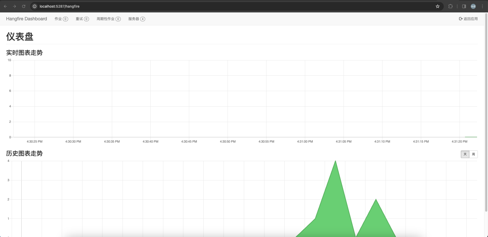
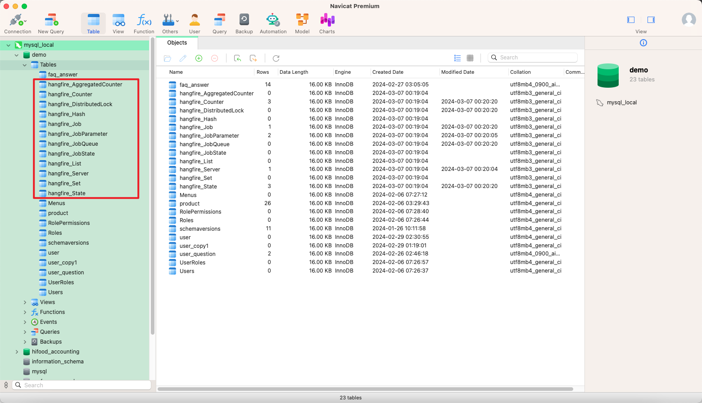
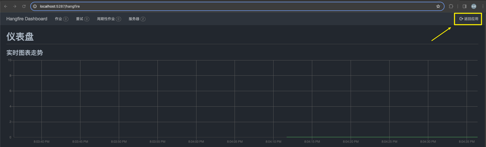
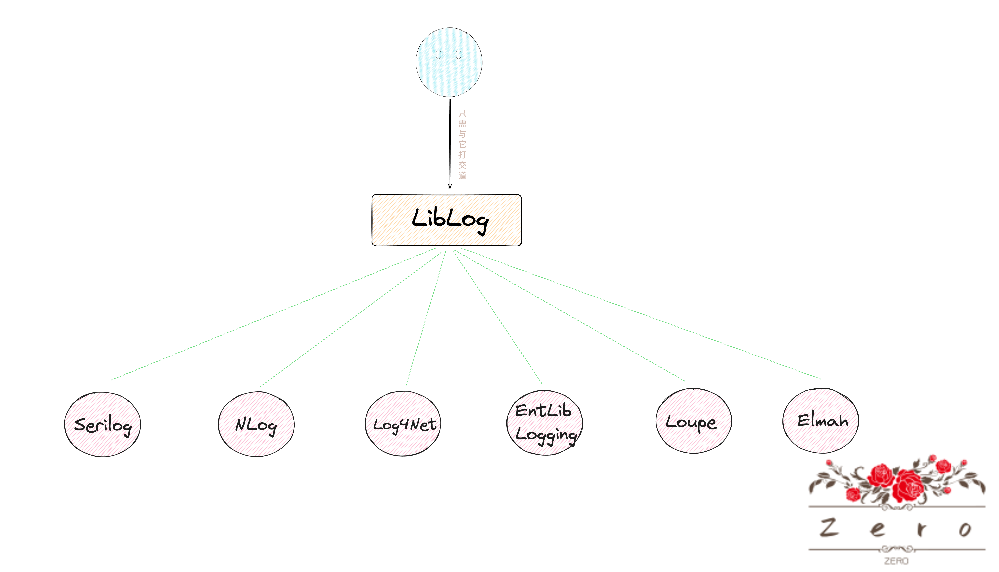
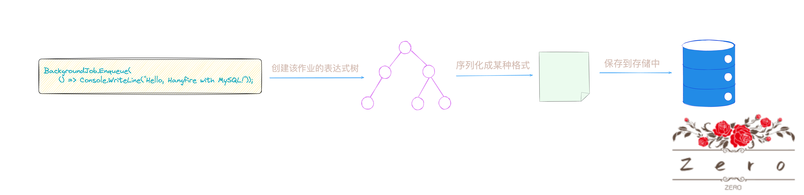

# 基概

* `Hangfire`是一个用于在`.NET`和`.NET Core`应用程序执行异步、延迟和定期任务的开源框架
* **使用`Hangfire`，我们可以将那些耗时的动作，比如说数据导入，邮件发送，定时任务等移至后台执行，从而使当前线程快速处理完请求并响应，以便于提供应用程序的响应速度和用户体验**
* 下面是关于一些`Hangfire`的概念
  * **后台作业**：也就是代执行的任务，根据实际执行的时机不同，可以分类为即时执行的作业、延迟执行的作业和定期执行的作业
  * **队列**：后台作业被放入不同的队列中等待执行
  * **服务器**：`Hangfire`服务器是一个专门负责从队列中取出作业并执行他们的组建，一个应用程序或者一台服务器上可以配置多个`Hangfire`服务器，实现其高可用性
  * **存储**：`Hangfire`需要一个存储用来保存它的后台作业及相关信息，支持多种数据库，比如说`MySQL`，`Redis`，`SQl Server`等
  * **仪表盘**：`Hangfire`提供了一个可选的`Web`仪表盘界面，用来监控和管理后台作业
  * **过滤器**：`Hangfire`可以通过过滤器来实现拦截作业的执行过程，从而实现一些自定义逻辑，如日志记录等

# 使用

## - 整合进`.NET Core`项目

* 以使用`MySQL`作为存储为例

1. 通过`NuGet`导入相关包

   ```c#
   <PackageReference Include="Hangfire" Version="1.8.11" />
   <PackageReference Include="Hangfire.MySqlStorage" Version="2.0.3" />
   ```

2. 在`Startup.cs`的`ConfigureServices()`中注册服务以及配置`Handfire`服务器

   ```c#
   			// 创建 MySQL 存储选项
           var storageOptions = new MySqlStorageOptions
           {
               TablesPrefix = "hangfire_",   // 设置表名前缀
               QueuePollInterval = TimeSpan.FromSeconds(15)  // 设置队列轮询间隔
           };
           services.AddHangfire(config => config.UseStorage(
               new MySqlStorage(Configuration.GetConnectionString("Default"), storageOptions)));
   
           services.AddHangfireServer(options =>
           {
               options.SchedulePollingInterval = TimeSpan.FromSeconds(10);
           });
   ```

3. 在`Startup.cs`的`Configure()`方法中配置启动`Hangfire`服务器以及配置添加仪表盘

   ```c#
     app.UseHangfireServer();
     app.UseHangfireDashboard();
   ```

   * 需添加在`app.UseRouting();`和`app.UseEndpoints()`之间

4. 启动项目即可，仪表盘默认访问路径为`/hangfire`

   

5. 可以看到数据库上生成了很多关于`Hangfire`的表

   


## - 配置


### · 存储

* **`Hangfire`会将作业以及相关信息通过保存在数据库来实现的**

* 在程序崩溃，服务器出问题时，作业信息依旧保存在数据库中，当应用程序或者服务器重新恢复时，`Hangfire`依旧可以从数据库中读取这些信息，并继续处理未完成的作业

* 这也就是`Hangfire`确保其可靠性以及持久性的原因

* `Hangfire`支持多种数据库，如下是支持的数据库以及对应需要用到的`NuGet`包

  |      Database       |        NuGet包         |
  | :-----------------: | :--------------------: |
  |    `Sql Server`     |   Hangfire.SqlServer   |
  |       `Mysql`       | Hangfire.MySqlStorage  |
  |    `PostgreSQL`     |  Hangfire.PostgreSql   |
  |       `Redis`       |   Hangfire.Pro.Redis   |
  |      `MongoDB`      |     Hangfire.Mongo     |
  |      `SQLlite`      |    Hangfire.SQLite     |
  | `In-Memory Storage` | Hangfire.MemoryStorage |

* 可以看到`Hangfire`支持的数据库是非常丰富的，基本能够适用于我们的各种开发场景

* 对于采用不同的数据库作为存储时，其步骤也很简单

  1. 第一步就是导入对应的`NuGet`包了，当然也要包括`Hangfire`这个包

  2. 第二部就是去配置服务时告知`Hangfire`采用的是那个数据库，以及一些配置规则，这是在`Startup.cs`类的`ConfigureServices()`中设置的

     ```c#
      public void ConfigureServices(IServiceCollection services)
         {
             services.AddControllersWithViews();
     
             // 创建 MySQL 存储选项
             var storageOptions = new MySqlStorageOptions
             {
                 TablesPrefix = "hangfire_",   // 设置表名前缀
                 QueuePollInterval = TimeSpan.FromSeconds(15)  // 设置队列轮询间隔
             };
             // 配置数据库
             services.AddHangfire(config => config.UseStorage(
                 new MySqlStorage(Configuration.GetConnectionString("Default"), storageOptions)));
     
             services.AddHangfireServer(options =>
             {
                 options.SchedulePollingInterval = TimeSpan.FromSeconds(10);
             });
         }
     ```

     

### · 使用仪表板

* `Hangfire`内置了一个`OWIN`中间件的仪表板给我们使用

* **在这个仪表板的界面上，我们可以找到有关后台作业的所有信息**

* 使用起来也超级简单，在`Startup.cs`的`Configure()`中只需要配置一句代码即可

  ```c#
  app.UseHangfireDashboard();     // 配置 Hangfire 仪表盘
  ```

* `URL`映射

  * <b style="color:green">默认情况下，`UseHangfireDashboard()`会将仪表板`UI`界面映射到`/hangfire`路径上</b>

  * 如果想要更改此映射路径，只需要在调用`UseHangfireDashboard()`时传递`URL`作为参数即可

    ```c#
    app.UseHangfireDashboard("/jobs");   // 配置 Hangfire 仪表盘
    ```

* 返回站点连接

  * <b style="color:green">在仪表板的`UI`界面，留有一个扩展的「返回站点连接」，可用它来引导我们返回应用程序的根`URL`，默认值为`/`</b>

    

  * 如需更改这个根`URL`值，需在`UseHangfireDashboard()`时通过`DashboardOptions`类型的参数修改它

    ```c#
    public void Configure(IApplicationBuilder app, IWebHostEnvironment env)
    {
        app.UseHangfireDashboard("/hangfire", new DashboardOptions
        {
            DashboardTitle = "My Dashboard",
            AppPath = "/my-home-page",  // 设置返回站点链接
        });
    }
    ```

* 多个仪表板

  * **`Hangfire`支持配置多个仪表板，每个仪表板显示有关不同存储的信息，达到分门别类展示的目的**

  * 如需配置多个仪表板，只需重复调用不同配置参数的`UseHangfireDashboard()`方法即可

    ```c#
     // 配置第一个仪表板
        app.UseHangfireDashboard("/hangfire-dashboard-1", new DashboardOptions
        {
            DashboardTitle = "Dashboard 1",
            // 其他配置...
        });
    
        // 配置第二个仪表板
        app.UseHangfireDashboard("/hangfire-dashboard-2", new DashboardOptions
        {
            DashboardTitle = "Dashboard 2",
            // 其他配置...
        });
    ```

* 仪表板只读

  * <b style="color:green">仪表板可以设置为只读的，意味着可以防止用户更改任何内容，默认情况只读是处于关闭状态的</b>

  * 如需开启，也是在配置仪表板的`UseHangfireDashboard()`方法时配置起参数即可

    ```c#
    app.UseHangfireDashboard("/hangfire", new DashboardOptions
    {
        IsReadOnlyFunc = (DashboardContext context) => true
    });
    ```

* 配置授权

  * `Hangfire`的仪表板公开了有关后台作业的敏感信息，包括方法名称和序列化参数

  * <b style="color:green">为了确保其安全性，所以默认情况下仪表板仅允许本地请求</b>

  * 但是我们可以通过实现`IDashboardAuthorizationFilter`接口来实现请求允许或禁止

    ```c#
    // 自定义逻辑
    public class MyAuthorizationFilter : IDashboardAuthorizationFilter
    {
        public bool Authorize(DashboardContext context)
        {
            var httpContext = context.GetHttpContext();   // <--这个是扩展方法，需要用到Hangfire.AspNetCore包
            return httpContext.User.Identity?.IsAuthenticated ?? false;
        }
    }
    ```

    ```c#
    // 然后配置即可
    app.UseHangfireDashboard("/hangfire", new DashboardOptions
    {
        Authorization = new [] { new MyAuthorizationFilter() }
    });
    ```

    * <b style="color:red">ps：应该先配置身份验证中间件，然后再配置 Hangfire 仪表盘中间件。这样，当仪表盘接收到请求时，身份验证中间件已经准备好了，能够正确地处理身份验证逻辑，所以`UseHangfireDashboard()`应该放在`app.UseAuthentication();        app.UseAuthorization();`后面</b>


### · 日志

* `Hangfire`使用了一个名为`LibLog`的包来处理日志记录

* `LiblLog`是一个在`.NET`库中使用的日志记录抽象层，使用了一种类似于门面模式的设计，不直接依赖与任何特定的日志框架，底层隐藏了不同日志框架的复杂性

* **它提供了一个统一通用的接口给我们开发者使用，让开发者关注于日志记录功能的使用，而不需要关心具体使用的是哪个日志框架**

  

* <b style="color:red">`LibLog`在运行时回自动检测并适配应用程序中已经存在的日志框架</b>

  * **如果说当前应用程序没有使用任何日志框架**，`LibLog`会采取下面行为

    * **无操作**（No-OP）：`LibLog`会使用一个默认的"无操作"日志提供者，这意味着所有的日志消息都会背丢弃，不会有任何输出

    * **控制台输出**（可选）：可以选择让`LibLog`将日志消息输出到控制台（通过配置`LibLog`的日志级别）

      ```c#
      {
        "logging": {
          "logLevel": {
            "Default": "Information",
            "Hangfire": "Information"         //<------ 配置Hangfire的日志级别
          }
      }
      ```

  * **如果说当前应用程序中引用了多个日志框架**

    * `LibLog`将按照其内部的优先级顺序选择一个日志框架来使用（通常这个选择是基于哪个日志框架最先被发现的原则）

    * 为例避免歧义或导致`LibLog`使用的不是我们期望的日志框架，需要明确地告诉`LibLog`使用哪个日志框架

      ```c#
      public void ConfigureServices(IServiceCollection services)
      {
          // 其他服务配置...
          services.AddHangfire(configuration => configuration
              .UseLog4NetLogProvider()  // 使用 log4net
              .UseSqlServerStorage("YourConnectionString"));
      }
      ```

* 对于简单的应用程序，可以使用`Hangfire`提供的内置控制台日志提供程序来记录日志信息
  * 这个日志提供程序会将日志消息输出到控制台，并且**支持不同级别的日志消息显示不同的颜色以便于区分**
  * 但要注意这个控制台日志提供程序在写入日志消息时会获取一个全局锁，以确保在控制台上输出的日志颜色时正确的
  * 这种锁机制可能会导致性能问题，因此建议只在开发环境中使用

* 日志级别如下所示：

  |  Grade  |                          Descripion                          |
  | :-----: | :----------------------------------------------------------: |
  | `Trace` | 这些消息用于调试 Hangfire 本身，以查看发生了哪些事件以及采用了哪些条件分支。 |
  | `Debug` | 使用此级别可以了解为什么后台处理不适合您。此级别没有消息计数阈值，因此可以在出现问题时使用它。但与下一个级别相比，预计消息数量会更多。 |
  | `Info`  | 这是**建议的**最低登录级别，以确保一切按预期工作。处理服务器通常使用此级别来通知启动和停止事件 - 也许是最重要的事件，因为非活动服务器不处理任何内容。从这个级别开始，Hangfire 尝试记录尽可能少的消息，以免损害日志子系统。 |
  | `Warn`  | 由于某种原因，后台处理可能会延迟。可以采取相应的操作来最大程度地减少延迟，但无论如何都会有另一次自动重试尝试。 |
  | `Error` | 由于某些持续很长时间的外部错误，后台进程或作业无法执行其工作。通常，只有在多次重试之后才会记录此级别的消息，以确保您不会收到有关瞬时错误或网络故障的消息。通常，在解决这些消息的原因后，您不需要重新启动处理服务器，因为在一段延迟后将自动进行另一次尝试。 |
  | `Fatal` | 当前处理服务器将不再处理后台作业，需要人工干预。此日志级别在 Hangfire 中几乎未使用，因为除了重试逻辑本身之外，几乎到处都有重试。理论上，`ThreadAbortException`可能会导致致命错误，但前提是它被抛出在错误的地方——通常线程中止会自动重置。另请记住，如果进程意外终止，将无法记录任何内容。 |


### · 队列

* <b style="color:green">在`Hangfire`，默认情况下，所有的作业都会被放入到名为`default`的队列中</b>

* 我们也可以创建额外的队列并为不同的作业指定不同的队列，以此来控制作业的执行顺序和优先级

* 示例如下

  1. 创建队列：在`Hangfire`启动服务器时，即可配置队列的名称列表

     ```c#
     services.AddHangfireServer(options =>
     {
         options.Queues = new[] { "critical", "default", "low" };
     });
     ```

     * **原始的`default`队列在此自定义队列时如果没有指定，则会完全移除**
     * **队列名称是区分大小写的**
     * **队列名称仅包含小写字母，数据，下划线和破折号**

  2. 在创建作业时指定队列

     ```c#
     // 将即时作业添加到 "critical" 队列
     BackgroundJob.Enqueue(() => SomeMethod(), "critical");
     // 将延迟作业添加到 "critical" 队列
     BackgroundJob.Schedule(() => SomeMethod(), TimeSpan.FromDays(1), "critical");
     // 将定时作业添加到 "critical" 队列
     RecurringJob.AddOrUpdate("some-id", () => SomeMethod(), Cron.Daily, queue: "critical");
     ```

* 队列的处理顺序取决于具体的存储实现（适用于单个服务器示例）

  * **对于`MySQL`和`Redis`，队列的处理顺序是按照我们在配置中指定的顺序来确定的**
  * **而对于`SqlServer`，队列的处理顺序是按照字母顺序来确定的**

* 对于多个服务器示例，如果需要保证作业在多个服务器之间的严格执行顺序，可以考虑使用不同的队列名称为每个服务器实例来处理特定队列的作业

  * 这里解释下为什么多个服务器示例时，无法保证作业的严格执行顺序
  * 假设现在服务器1和服务器2都同时监听着某个队列，并且这个队列上存在着作业A，B，C
  * 理论上作业A，B，C是严格按照这个顺序执行完的
  * 但是比如说服务器1拿作业A来处理，但是处理周期比较长
  * 就在这个处理周期内，服务器2把作业B，C拿到并处理完了
  * 此时作业的执行顺序严格意义上讲就不是顺序的了


### · 过滤器

* `Hangfire`的过滤器提供了一种强大的机制，允许我们在作业执行的不同阶段插入自定义逻辑

* 下面是一些常见的过滤器类型

  * `Authorization Filter`：用于控制对`Hangfire`仪表盘的访问权限
  * `Client Filter`：在作业被添加到队列之前或之后执行
  * `Server Filter`：在作业执行之前，之后或执行失败时执行
  * `Elect State Filter`：在作业状态改变时执行
  * `Apply State Filter`：在作业状态被应用之前或之后执行

* 如果有需要，我们是可用通过创建一个实现对应接口的过滤类来实现自定义逻辑，如下所示；

  1. 自定义一个服务器过滤器

     ```c#
     public class MyServerFilter : IServerFilter
     {
         public void OnPerforming(PerformingContext filterContext)
         {
             // 在作业执行之前执行的逻辑
             Console.WriteLine($"Starting job: {filterContext.BackgroundJob.Id}");
         }
         public void OnPerformed(PerformedContext filterContext)
         {
             // 在作业执行之后执行的逻辑
             Console.WriteLine($"Finished job: {filterContext.BackgroundJob.Id}");
         }
     }
     ```

  2. 配置自定义过滤器

     ```c#
     public void ConfigureServices(IServiceCollection services)
     {
         services.AddControllersWithViews(options =>
         {
             options.Filters.Add(new MyCustomActionFilter()); // 添加自定义过滤器作为全局过滤器
         });
     }
     ```

     


## - 加入后台作业

### · 立马执行

* 使用上很简单，通过一句简单的`BackgroundJob.Enqueue()`调用，我们只需传递带有相应方法及参数的`Lambda`表达式

  ```c#
  BackgroundJob.Enqueue(() => Console.WriteLine("Hello, world!"));
  ```

* `Hangfire`走到`Enquue（）`这句代码时不会立即调用目标方法，而是运行下面步骤（其他类型的后台作业的加入流程也是如下）

  1. 序列化方法信息及其所有参数
  2. 根据序列化信息创建新的后台作业
  3. 将后台作业保存到持久存储中
  4. 将后台作业排队到其队列中

* 上述只是把后台作业加入的过程，**后续是通过`Hangfire Server`来检查持久存储中是否有拍排队的后台作业并以可靠的方式执行他们**

* 排队的作业由专用的工作线程池处理，每个`Worker`都会调用一下流程

  1. 获取下一份作业并对其他`Worker`隐藏
  2. 执行作业以及所有的扩展过滤器
  3. 从队列中删除作业

* 所以，只有在作业被成功处理后，其才会被删除


### · 延迟执行

* 使用上很简单，通过一句简单的`BackgroundJob.Schedule()`调用，我们只需传递带有相应方法及参数的`Lambda`表达式，以及延迟时间

  ```c#
  BackgroundJob.Schedule(
      () => Console.WriteLine("Hello, world"),
      TimeSpan.FromDays(1));
  ```

* **`Hangfire Server`会定期检查数据库的这些延迟后台作业**

* **当检测到这些延迟后台作业到达执行时间点时，就会将他们排入到队列中，从而允许`Worker`去执行他们**


### · 重复执行

* 使用上很简单，通过一句简单的`RecurringJob.AddOrUpdate()`调用，表示创建或更新一个重复作业

* **除了作业任务外，我们还需要指定一个标识符（方便后面引用我们的作业）以及一个定时执行的规则**

  ```c#
  RecurringJob.AddOrUpdate("easyjob", () => Console.Write("Easy!"), Cron.Daily);
  ```

* 配置定时规则时的`Cron`包含不同的方法和重载，可以按照分钟，每小时，每天，每周，每月，和每年的规则运行作业

* 同时也可以通过`Cron`表达式来指定更为复杂，自定义的定时规则

  ```c#
  RecurringJob.AddOrUpdate("powerfuljob", () => Console.Write("Powerful!"), "0 12 * */2");
  ```


* **对于标识符，需保持唯一性**
  * 如果我们为不同的定时任务使用相同的唯一标识符，`Hangfire`会认为它们是同一个任务，只保留最后一个添加或更新的任务配置
  * 这就意味着之前使用相同标识符配置的任务将会被覆盖，最终我们只有一个任务在运行
  * 同时，对于标识符，在不同的存储实现中，有的可能是区分大小写的，有的可能不区分
  * 所以在实际配置时，我们需注意使用的存储实现中到底区不区分大小写
  * <b style="color:green">最佳的配置方式呢就是统一当存储是不区分大小写的</b>


* `Hangfire`中有一个特殊的组件负责定期检查是否有重复作业需要执行
  * 这个检查是基于分钟的，也就每分钟都会检查一次是否有有重复作业到了执行时间
  * 当重复作业到了执行时间，这个组件就会把这个重复作业当作一个`fire-and-forget`（立马且执行一次）的作业排入队列中


* 也可以通过调用`RemoveIfExists`来删除现有的重复作业（如果不存在此重复作业，不会引发异常）

  ```c#
  RecurringJob.RemoveIfExists("some-id");
  ```

* 如果想马上执行重复作业，可以通过调用`Trigger()`来实现

  ```c#
  RecurringJob.Trigger("some-id");
  ```

  * <b style="color:red">特别注意：使用`Triggle()`去立马执行一次重复作业，并不会影响到这个重复作业的下次执行时间</b>
  * 举个例子，假设一个重复作业的定时执行规则为每两小时执行一次，那么我们在一小时后手动调用`Trigger()`方法执行它，这次手动执行并不会影响到它的周期，这意味着在下一个两小时的周期到来时（也就是从最初的计划执行时间算起的两小时后，从手动调用`Triggle()`执行它的一小时后），这个重复作业会按照规则计划执行，并不受手动触发的影响

* `RecurringJob`类是`RecurringJobManager`类的门面，如果想要更多的自定义和控制，可以考虑使用`RecurringJobManager`类


* 执行的流程如下所示：

  1. **计划任务的存储**：当你使用 Hangfire 创建一个任务时，任务的相关信息（包括执行时间点等）会被存储在配置的持久化存储中（如 SQL Server、Redis 等）。

  2. **轮询检查**：Hangfire 服务器会定期（根据配置的轮询间隔）查询存储中的任务信息，以检查是否有任务到达了执行时间点。

  3. **任务入队**：如果检测到某个定时任务到了执行时间点，Hangfire 服务器会将该任务放入相应的队列中等待执行。

  4. **任务执行**：工作线程会从队列中取出任务并执行。执行完成后，任务的状态会被更新，并记录执行结果。


## - 原理

### 1.  配置作业，存储后台

1. 当我们通过`Hangfire`创建一个作业时（接受的是表达式树，通常我们用`Lambda`来表示）
2. 无论这个作业是即时的，还是延迟的，还是定时的，<b style="color:green">`Hangfire`首先会构建表示该作业的表达式树</b>
3. 该表达式树包含了方法调用的信息以及传递给方法的参数
4. 接下来，<b style="color:green">`Hangfire`就会序列化这个表达式树，将表达式树转换成一种格式，使其能够被存储在持久化存储中，并且在之后可以被反序列化以重建表达式树</b>
   * 默认情况下，`Hangfile`会使用一种特殊的序列化格式，这个格式并不是通用的`Json`或`XML`，而是一种专为`Hangfire`内部使用而优化的格式，专门为系列化和反序列化表达式树而设计的
   * 这个序列化器可以进行配置，比如说使用基于`Newtonsoft.Json`的`JsonNetSerializer`
5. <b style="color:green">序列化的作业信息接着就会被存储在配置的持久化存储中</b>（比如说`MySQL`）




### 2.  作业检查，放入队列

1. 在上述序列化的作业信息存储到持久化存储中后

2. 此时基于作业的类型会有不同的流程走向

   * 当作业类型为即时的（也就是通过`BackgroundJob.Enqueue()`配置的作业）

     > * 会立马被放入到队列中等待执行

   * 当作业类型为延迟的（也就是通过`BackgroundJob.Schedule()`配置的作业）

     > 1. 此作业会被标记在将来某个时间点执行
     >
     > 2. `Hangfire`的调度轮询器`Scheduled Job Poller`会定期检查存储中是否有无延迟作业到达了执行时间
     >
     > 3. 当一个延迟作业到达执行时间时，它会被移动到相应的队列中

   * 当作业类型为定时的（也就是通过`RecurringJob.AddOrUpdate()`配置的作业）

     > 1. 会根据设定的时间表重复执行
     >
     > 2. `Hangfire`的循环调度程序`Recurring Job Scheduler`会根据作业的时间表定期将作业排入队列
     >
     > 3. 每当定时作业达到了执行时间，循环调度程序会创建一个这个定时作业的即时作业
     >
     > 4. 并将其放入队列中


### 3.  监测队列，执行作业

1. <b style="color:green">`Server`中的工作进程`Workers`会持续监听队列</b>

2. <b style="color:green">当队列中有代执行的作业时，`Workers`会立即从队列中取出作业并开始执行</b>

3. <b style="color:green">如果队列为空，则`Workers`进程会等待直到有新的作业加入队列</b>

   > * `Workers`使用的是一组阻塞的监听机制
   > * 这意味着，当队列为空时，`Workers`会处于等待状态
   > * 一旦队列中有新作业加入，`Workers`会立即被唤醒并开始处理这个新作业
   > * 这种机制确保了作业可以被及时处理，同时避免了不必要的轮询和资源浪费

*  Hangfire 使用一组独立的线程来执行后台作业，这些线程与处理前端用户请求的线程是分开的，从而确保后台作业的处理不会干扰到用户请求的处理


### 4. 作业执行完后的后续

* **作业在执行完成后通常会被标记为`Successed`或`failed`状态，并保存在存储中一段时间**

* 这样我们可以通过仪表盘来查看作业的执行结果和历史

* <b style="color:red">执行完的作业并不会立即在存储中删除，但在一定时间后（根据配置的过期时间）自动清理</b>

* 配置过期时间如下：

  ```c#
  var storageOptions = new MySqlStorageOptions
      {
          JobExpirationTimeout = TimeSpan.FromDays(7) // 设置作业的保留时间为7天
      };
  
  services.AddHangfire(config => config
      .UseStorage(new MySqlStorage("YourConnectionString", storageOptions)));
  ```


### · 作业执行时若出现异常

* **`Hangfire`设计了一套异常处理机制，用于捕获和处理在其内部运行时以及执行外部作业和过滤器时发生的异常**

* 所有捕获的异常都会被记录下来

* <b style="color:green">对于执行外部作业时若发生异常，`Hangfire`会将此作业标记为`failed`状态，并提供了自动重试机制，根据配置重试执行</b>

* <b style="color:green">默认情况下，`Hangfire`会在一定时间间隔后重试执行，最多重试10次，每次重试的时间间隔会逐渐增加</b>

  * 配置重试次数

    * 全局配置

      ```c#
      public void ConfigureServices(IServiceCollection services)
          {
              services.AddHangfire(configuration =>
              {
                  configuration
                      .UseSqlServerStorage("YourConnectionString");
      
                  // 添加全局作业过滤器
                  GlobalJobFilters.Filters.Add(new AutomaticRetryAttribute
                  {
                      Attempts = 3,        // <---重试次数
                      OnAttemptsExceeded = AttemptsExceededAction.Delete  // <--- 最后达到重试次数后还没执行成功后的操作  删除作业记录
                  });
              });
              services.AddHangfireServer();
          }
      ```

    * 通过`[AutomaticRetry]`属性应用局部方法上

      ```c#
      public class MyJobs
      {
          [(Attempts = 5, OnAttemptsExceeded = AttemptsExceededAction.Delete)]
          public void SomeJobMethod()
          {
              // 作业逻辑
          }
      }
      ```

  * 配置重试时间间隔

    * 创建一个实现`IApplyStateFilter`接口的类，并重写间隔的逻辑

      ```c#
      public class CustomRetryAttribute : JobFilterAttribute, IApplyStateFilter
      {
          public void OnStateApplied(ApplyStateContext context, IWriteOnlyTransaction transaction)
          {
              if (context.NewState is ScheduledState scheduledState && context.OldState is FailedState)
              {
                  // 设置自定义的重试间隔
                  scheduledState.EnqueueAt = DateTime.UtcNow.AddMinutes(5); // 重试间隔为 5 分钟
              }
          }
          public void OnStateUnapplied(ApplyStateContext context, IWriteOnlyTransaction transaction)
          {
          }
      }
      ```

    * 应用

      ```c#
      // 应用于特定作业方法
      public class MyJobs
      {
          [CustomRetry]
          public void SomeJobMethod()
          {
              // 作业逻辑
          }
      }
      
      // 或者应用于全局配置
      GlobalJobFilters.Filters.Add(new CustomRetryAttribute());
      
      ```

      

* <b style="color:green">如果一个作业连续失败并达到最大重试次数，`Hangfire`将不会尝试执行该作业，并将此作业标记为最终失败状态--这样可以防止无休止的重试无法成功的作业</b>


###  · 作业相关联的过滤器

* 在`Hangfire`，从加入一个作业，到它存储到持久化存储中，和它最终执行完这个流程中

* <b style="color:green">每个不同的阶段都会执行与该作业相关联的过滤器</b>

* 下面时一些常见的过滤器

  * 队列过滤器`Queue Filters`

    > * 在将作业加入队列或者从队列中取出作业时使用

  * 应用状态过滤器`Apply State Filters`

    > * 在作业状态改变时使用

  * 电子状态过滤器`Elect State Filters`

    > * 在确定作业下一个状态时使用，可以用于决定是否重试作业或将其标记为失败

  * 性能计数器过滤器`Performance Counters Filters`

    > * 用于监控和收集作业执行的性能数据

# 注意事项

* 在`Hangfire`中，工作线程`Workers`并不是固定分配给特定队列的，而是可以从任何可用的队列中获取和处理作业，这意味着**工作线程都可以从多个队列中后获取作业执行，而不是只从一个特定的队列中获取作业**

* <b style="color:green">对于延迟作业和定时作业，是可以通过调用`Trigger()`去手动触发作业，但是请注意这些作业仍待会在原定的延迟，定时时间后自动执行</b>

  ```c#
  // 创建一个延迟任务，延迟 6 小时执行
  var jobId = BackgroundJob.Schedule(() => Console.WriteLine("Delayed job"), TimeSpan.FromHours(6));
  
  // 在某个时间点，决定手动触发这个延迟任务
  BackgroundJob.Trigger(jobId);
  //-------------------------------------------------------------
  // 添加或更新一个定时任务
  RecurringJob.AddOrUpdate("my-recurring-job", () => Console.WriteLine("Recurring job"), Cron.Hourly);
  
  // 在某个时间点，决定手动触发这个定时任务
  RecurringJob.Trigger("my-recurring-job");
  ```

* <b style="color:green">`Hangfire`的`Server`监测存储中是否有无满足已到时间点，代执行的作业，这个轮询是有间隔的，那么也就意味着在实际上作业的执行时间点和它配置中的预期执行时间点是不一定严格一致的，是会有一定时间差的（大多数情况下这个时间差是可以接受的，轮播间隔配置的越小，定时任务的执行时间就越精确，但与此同时服务器的性能开销也会相应增加，需要根据实际需求来平衡轮训间隔的设置）</b>

  * 假设我现在有个延迟作业定在今天的17:30:20秒执行，然后我的系统在00:00:00刚好启动完，轮训间隔为15秒
  * 那么以此推理，这个作业实际在执行到的时间点应该为17:30:30
  * 也就是有个5秒的时间差

* 作业的常见状态如下：
  * `Enqueued`（排队中）：作业被添加到队列中，等待被工作线程处理
  * `Scheduled（已经计划）`：作业被安排在将来的某个时间点执行，这是延迟作业和定时作业的初始状态
  * `Processing（处理中）`：工作线程已经从队列中取出作业并开始执行，在这个状态下，作业正在运行
  * `Succeeded（成功）`：作业已经成功执行完--执行结果和完成时间会被记录
  * `Failed（失败）`：作业执行过程中发生了异常，导致作业失败，异常失信会被记录，并且根据配置，作业可能会被重新排队尝试重试
  * `Awaiting（等待中）`：作业正在等待另一个作业完成后才能继续执行--通常用于创建作业链
  * `Deleted（已删除）`：作业已从系统中移除--可能时因为作业已经完成并且过了保留时间，或者是手动删除
  * `Retrying（重试中）`：作业执行失败后，根据重试机制，作业被重新排队等待重试
* **编写后台作业时，不能直接访问局部变量、实例字段或静态字段，以及一些其他可能与当前执行上下文相关的信息**。这是因为后台作业通常是在与原始请求或方法调用不同的上下文中执行的，可能是在不同的线程、进程甚至是不同的服务器上，**这意味着后台作业通常是在当前执行上下文之外执行的工作单元**

