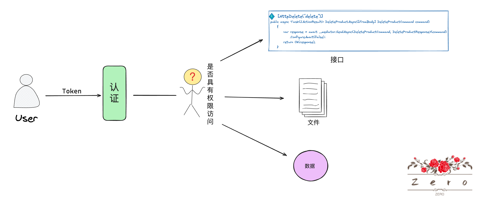
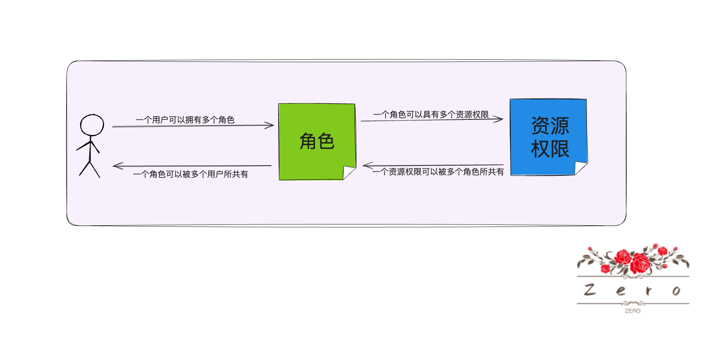
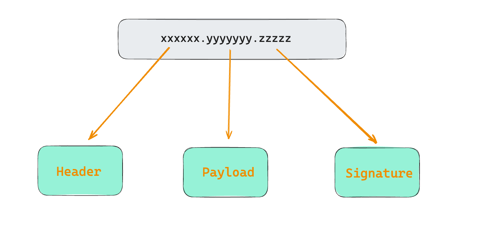
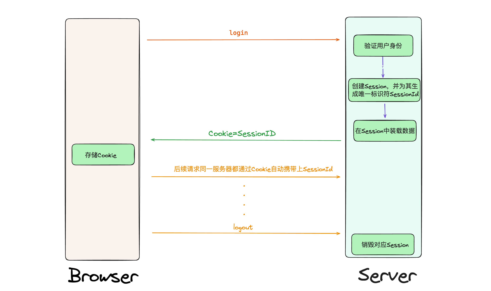
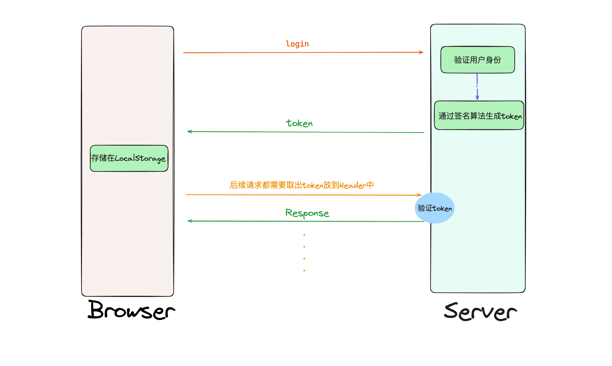

# 基概

## - 认证授权

### · 认证

* 认证，即`Authentication`，指验证用户的身份，是用来保护系统安全性的两大核心之一
* **它只做了一件事，即确定"你是谁"**
* <b style="color:red">通过验证用户提供的凭据，系统获取访问者的身份，确定你是否就是你提供凭据中所声称的那个人，是否就是系统中规定的合法访问者</b>
* 如果凭据相符，则授予访问权，否则就拒绝访问
* 常用的认证方式如下
  * 用户名 + 密码认证
  * 手机号 + 短信验证码认证
  * 邮箱 + 邮件验证码认证


### · 授权

* 即`Authorization,`<b style="color:red">授权是建立在认证的基础上，用以确定已经认证的用户是否具有权限访问某个系统资源的过程</b>，它是为了保护用户身份的合法性，更细粒度的对隐私数据进行划分

* 简单来说授权就是确定"你可以做什么"，它之所以是在认证之后进行的，是因为**系统不能在连对方都不知道是谁的情况下授予访问权限**

  


## - `RBAC`模型

* 在系统权限控制这块，最常采用的模型就是`RBAC`模型

* 所谓`RBAC`模型，是指**基于角色的权限访问控制(`Role-Based Access Control`)**

* 即在用户和资源之间加多了一层，通过角色去关联用户，同时又通过角色去关联资源

* 简单来说就是**先把资源按照一定规则统一先分配给角色， 再把角色分配给用户**

  

* 在数据库层面上，**根据`n-n`的关系需要添加中间表来进行映射**


## - `JWT`概念

* <b style="color:red">`Token`代表着一种数据或凭证，用于在系统之间或系统的不同部分之间传递信息，进行身份验证，授权访问等操作</b>

* 而`jwt`全名为`JSON Web Token`，顾名思义，这是一种`JSON`格式的`Token`

* 在`RFC 7519`中对`JWT`做了较为正式的定义

  > JSON Web Token (JWT) is a compact, URL-safe means of representing claims to be transferred between two parties.  The claims in a JWT are encoded as a JSON object that is used as the payload of a JSON Web Signature (JWS) structure or as the plaintext of a JSON Web Encryption (JWE) structure, enabling the claims to be digitally signed or integrity protected with a Message Authentication Code(MAC) and/or encrypted.

* `JWT`表现为一段字符串，通过`.`号进行切割，将其分成3个部分

  

* `Header`：头部

  * `Header`中通常包含两部分信息

    * 一是`Token`的类型（这里就是`JWT`）
    * 二是所使用的签名算法	

  * 原始的其`Json`数据可能如下

    ```json
    {
      "alg": "HS256",
      "typ": "JWT"
    }
    ```

  * **将此`Json`数据经过`Base64URL`编码**，所以`Header`部分看起来可能如下

    ```json
    eyJhbGciOiJIUzI1NiIsInR5cCI6IkpXVCJ9
    ```

* `Payload`：载荷

  * 这里是真正存放有效信息的地方，这些信息以一系列的`Claims`(声明)的形式出现
  * 其类型又分成了三种
    * `Registered Claims`：预定义的声明
      * <b style="color:red">这是`JWT`标准预定义的一组声明，推荐使用以提供一致的、互操作的`Token`，但不是必须的</b>
      * 常见的预定义声明如下
        * `iss(Issuer)`：表示`Token`的发行者
        * `sub(Subject)`：表示`Token`的主体对象
        * `aud(Audience)`：表示`Token`的预期接受方(假设多多个服务，此`Token`只针对服务A的访问，即可用上这个)
        * `exp(Expiration Time)`：表示此`Token`的过期时间
        * `nbf(Not Before)`：表示此`Token`在此时间之前不应被接受处理
        * `iat(Issued At)`；表示`Token`的签发时间
        * `jti(JWT ID)`：表示`JWT`的唯一标识符，主要用于重放攻击(即同一个`Token`被多次使用)
    * `Public Claims`：公共声明
      * 公共声明可以添加任何信息，用于在不用的应用和服务之间共享信息
      * 允许开发者、社区成员或不同的组织根据自己的需求来定义这些声明
    * `Private Claims`：私有声明
      * 属于发送方和接收方之间约定的信息，它们可以是任何双方同意的信息，用以共享应用或上下文特定的信息
  * **这部分的数据同样是先转化为`Json`字符串，然后再将此`Json`字符串经过`Base64URL`编码最后才形成`Payload`字符串**

* `Signature`：签名

  * 其生成步骤为
    1. 将刚刚经过`Base64URL`编码的`Header`和`Payload`字符串，通过`.`号连接起来，形成一个代签名字符串
    2. 采用`Header`部分指明的签名算法，对上面的代签名字符串进行签名
    3. 将生成的签名值经过`Base64URL`编码，最终得到`Signature`字符串
  * **这部分是用于确保`JWT`的完整性和真实性，接受方可以使用相同的步骤对传入的`Token`进行签名，并将结果与`Token`的`Signature`部分进行比较，如果两者相同，则说明此`Token`未被篡改**

# 认证机制

* `Http`协议是一种无状态的协议
* 这意味着**在使用`Http`协议作为通信协议的应用服务中，对于客户端发过来的请求，服务端并不能区分是哪个用户发出的**
* 而认证机制的目的就在于此

## - 基于`Session`的认证

* 用下图来描述整个流程

  

* 优点：

  * 流程很简单
  * `Session`是存储在服务端的，较为安全，可以存储敏感性数据
  * 客户端只需要存储一个`SessionId`，减轻了客户端的负担
  * 不依赖于平台和技术，大多数`Web`平台都支持，兼容性较好

* 缺点：

  * **`Session`是保存在服务端的，每一个用户`login`后都需要创建一个对应的`Session`，并在上面存储一些数据，随着用户数量的增加，这可能会导致服务器资源的显著消耗**
  * **服务器A创建的`Session`，客户端拿着这个`SessionId`发请求必须还得到这台服务器A上，其他服务器是无法识别的，这对于一些分布式系统中，`Session`的存储和同步成为一个问题(也有一定的解决方案，比如说固定请求路由规则或者说使用`Redis`作为存储`Session`的载体，但采用这些方案的同时也会带来一些额外小的问题)**

  * **攻击者可以利用浏览器自动发送`Session Cookie`的行为，基于`Session`的认证可能会更容易遭受到`CSRF`攻击，需要一些额外保护措施**
  * 受到浏览器的跨域策略限制，这可能导致限制某些应用场景的使用


## - 基于`JWT`的认证

* 用下图来描述整个流程

  

  * **`token`的存储对于`Web`应用，通常是存储在`LocalStorage`中，而对于移动应用，可能是`Keychain`或者`Keystore`**
  * <b style="color:red">请求携带`token`时，通常是放在`Header`中的`Authorization`字段，并以`Bearer `为前缀，这不是强制性的，而是一种广泛采用的约定，有助于在不同系统间保持一致性和互操作性</b>

* 优点

  * `JWT`是无状态的，包含了用户认证所需要的信息，使得服务端不需要存储会话信息，这样有利于应用的扩展，特别是在微服务架构和分布式系统中
  * `JWT`适用于多种编程语言和平台，可以在不同系统和服务之间安全的传输信息
  * `JWT`中可以包含自定义的`claims`，这为i传递关于用户信息和其他元数据提供了灵活性

* 缺点

  * `Token`一旦签发，直到它过期之前都是有效的，服务端并无直接的方式来使`Token`失效，需要额外的机制引入才行
  * `JWT`可能包含大量的`Claims`信息，这可能导致`Token`大小变大，由于每个请求都需要携带`Token`，这可能增加请求的负载，影响通行效率

# 使用

## -`Demo`

* 本`Demo`以使用`RSA`进行非对称加密

1. 通过`NuGet`导入`Microsoft.AspNetCore.Authentication.JwtBearer`包

2. 生成公钥密钥（为方便演示这里直接写入`xml`文件）

   ```c#
   using var rsa = RSA.Create(2048); // 创建2048位RSA密钥
   var privateKey = rsa.ToXmlString(true); // 包含私钥
   var publicKey = rsa.ToXmlString(false); // 不包含私钥
   ```

3. 在`Startup.cs`文件的`ConfigureServices()`中配置`JWT Bearer`认证服务

   ```c#
   services.AddAuthentication(JwtBearerDefaults.AuthenticationScheme)
               .AddJwtBearer(options =>
               {
                   options.TokenValidationParameters = new TokenValidationParameters()
                   {
                       ValidateIssuerSigningKey = true,
                       IssuerSigningKey = new RsaSecurityKey(rsa),//<--这个rsa是之前生成的公钥匙
                       ValidateIssuer = false,
                       ValidateAudience = false,
                       ValidateLifetime = true,
                       ClockSkew = TimeSpan.Zero
                   };
               });
   ```

4. 在`Startup.cs`文件的`Configure()`中配置中间件

   ```c#
   app.UseAuthentication();
   app.UseAuthorization();
   ```

   * **需确保添加到`app.UseRouting()`和`app.UseEndpoins()`之间**

5. 制造一个用于生产`Token`的`Service`，其中生产`Token`的逻辑如下（记得把此`Service`注入到容器中）

   ```c#
   public string GenerateToken(string username)
       {
           var signingCredentials = new SigningCredentials(new RsaSecurityKey(_privateRsa), SecurityAlgorithms.RsaSha256);
           var claims = new[]
           {
               new Claim(ClaimTypes.Name, username)
           };
           var jwt = new JwtSecurityToken(
               claims: claims,
               signingCredentials: signingCredentials,
               expires: DateTime.UtcNow.AddHours(1));
           var token = new JwtSecurityTokenHandler().WriteToken(jwt);
           return token;
       }
   ```

   * 这样的话登录后即可通过调用此`Service`的方法生产对应`Token`

6. 使用，在需要认证的接口上加上属性`[Authorize]`，这样的话后续访问此接口时自动会获取、解析`Token`，通过后才给予访问


## - 配置

### · 配置`Token`验证参数

* 我们可以详细地配置如何验证传入的`Token`，包括指定有效的发行者，密钥等

* 其配置位置在配置`Startup`文件的`ConfigureServices()`时，可以通过参数来传递我们的配置

  ```c#
  services.AddAuthentication(JwtBearerDefaults.AuthenticationScheme)
              .AddJwtBearer(options =>
              {
                // 配置验证参数
                  options.TokenValidationParameters = new TokenValidationParameters()
                  {
                    // 具体规则
                      ValidateIssuerSigningKey = true,
                      IssuerSigningKey = new RsaSecurityKey(rsa),
                      ValidateIssuer = false,
                      ValidateAudience = false,
                      ValidateLifetime = true,
                      ClockSkew = TimeSpan.Zero
                  };
              });
  ```

* 下面是一些常见的`Token`验证参数

  * `ValidateIssuer`：**确定是否验证`Token`的`Issuer`(发行者)，确保此`Token`是由信任的认证服务器发行的**
  * `ValidIssuer`：**指定一个预期的`Token`发行者（如果`ValidateIssuer`的值为`true`，则`Token`的`Issuer`必须于此值匹配才被视为有效）**
  * `ValidateAudience`：**确定是否验证`Token`的`Audience`(观众)，确保此`Token`是为当前正在访问的资源或服务发行的**
  * `ValidAudience`：**指定一个预期的`Token`观众，如果`ValidateAudience`的值为`true`，则`Token`的`Audience`必须与此值匹配才被视为有效**
  * `ValidateLifetime`：**确定是否验证`Token`的声明周期（即`nbf`(Not Before)、`exp`（Expirating Time声明，确保此`Token`在当前时间是有效的，未过期且已经达到生效时间**
  * `ClockSkew`：**设置时钟偏差的容忍时间，提供一定的时间容错范围，以解决服务器之间的小的时间不同步问题**
  * `ValidateIssuerSigningKey`：**确定是否验证签名密钥，确保`Token`的签名部分是使用正确的密钥签名的，从而验证其真实性**
  * `IssuerSigningKey`：**提供用于验证签名的密钥，这可以是对称密钥，也可以使用非对称密钥**
  * `RequireExpirationTime`：**指定`Token`是否包含`exp`声明，确保所有的`Token`都有一个明确的过期时间**

  （详细配置看`Microsoft.IdentityModel.Tokens`命名空间下的`TokenValidationParameters`类）


### · 处理认证事件

* 在处理认证时，可以通过设置一些事件让我们在认证过程中的不同阶段执行自定义逻辑

* 配置位置同样位于`Startup.cs`文件的`ConfigureServices()`方法中

  ```c#
  services.AddAuthentication(JwtBearerDefaults.AuthenticationScheme)
              .AddJwtBearer(options =>
              {
                // 配置认证事件
                  options.Events = new JwtBearerEvents()
                  {
                    // 具体某个事件的逻辑
                      OnAuthenticationFailed = context =>
                      {
                          Console.WriteLine(context);
                          Console.WriteLine("sdlfjskjflkdflsj");
                          return Task.CompletedTask;
                      }
                  };
              });
  ```

* 认证事件类型如下所示

  * `OnMessageReceived`：**每次接收到请求并提取`Token`时触发**
    * 应用：如果`Token`是从`URL`中或者请求体中传递的话，可以在这里进行提取逻辑
  * `OnTokenValidated`：**`Token`已被成功验证后触发**
    * 应用：在验证通过后添加自定义的用户身份验证逻辑，比如说加载用户的角色信息等等
  * `OnAuthenticationFailed`：**`Token`验证失败时触发，如过期，签名错误等等**
    * 应用：记录认证错误信息或者像客户端发送自定义错误消息
  * `OnChanllenge`：**当请求需要认证而没有提供有效`Token`时触发**
  * `OnForbidden`：**当用户通过认证但不具备执行当前操作所需权限时触发**


### · 授权

* **授权确保了用户只能访问的到在他们权限之内的资源的过程**

* 常见的授权形式如下

  * 角色-based授权

    ```c#
    [Authorize(Roles = "Admin")]
    public class AdministrationController : Controller
    {
        // 只有角色为Admin的用户才能访问
    }
    ```

    * **`Token`解析后，会将其包含的`Claims`用来构建用户的`ClaimsPricipal`对象，这个`Roles`的要求值就会到这个`ClaimsPricipal`对象中查看是否又误，有则放行，无则拒绝**

  * 策略-based授权

    * 先通过自定义一定的授权规则

      ```c#
      services.AddAuthorization(options =>
      {
          options.AddPolicy("EmployeeOver18", policy =>
              policy.RequireClaim("EmployeeNumber")
                    .RequireClaim("DateOfBirth", /* 验证年龄的逻辑 */));
      });
      ```

    * 然后在控制器或者动作中使用这个策略

      ```c#
      [Authorize(Policy = "EmployeeOver18")]
      public IActionResult EmployeeSection()
      {
          // 代码
      }
      ```

  * 实现资源-based授权

    1. 创建一个某种资源的授权逻辑(通过继承资源-based授权`AuthorizationHandler<T, Document>`来实现)

       ```c#
       public class DocumentAuthorizationHandler : AuthorizationHandler<SameOwnerRequirement, Document>
       {
           protected override Task HandleRequirementAsync(AuthorizationHandlerContext context,
                                                          SameOwnerRequirement requirement,
                                                          Document resource)
           {
               if (context.User.Identity?.Name == resource.OwnerId)
               {
                   context.Succeed(requirement);
               }
               return Task.CompletedTask;
           }
       }
       public class SameOwnerRequirement : IAuthorizationRequirement { }
       ```

    2. 配置服务

       ```c#
       services.AddAuthorization(options =>
       {
           options.AddPolicy("SameOwner", policy =>
               policy.Requirements.Add(new SameOwnerRequirement()));
       });
       services.AddSingleton<IAuthorizationHandler, DocumentAuthorizationHandler>();
       ```

    3. 在接口中实现授权逻辑判断

       ```c#
       var document = _documentRepository.Get(documentId);
       
           var authorizationResult = await _authorizationService
               .AuthorizeAsync(User, document, "SameOwner");
           if (authorizationResult.Succeeded)
           {
           }
           else
           {
           }
       ```

# 注意事项

* <b style="color:red">`JWT`中的`Header`和`Payload`都只是将原`Json`数据经过`Base64URL`编码处理得到的，而`Base64URL`只是个编码格式并非加密算法，也就是说通过解码即可得到原始数据，`so`在`Header`和`Payload`中禁止存放敏感信息</b>


