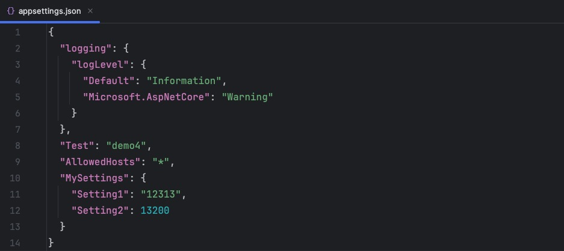
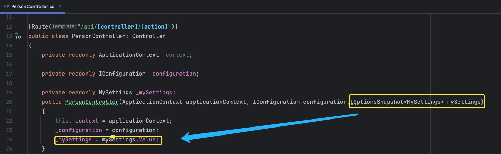

## 基概

* `Settings`指的是对于程序内一些**可以决定程序行为的配置数据**，比如常见的数据库连接字符串，第三方`API`的密钥等

* 相较于传统式在代码中固定写死这些配置信息，使用`Settings`的优势是很明显的
  * **分离配置和代码**：对配置信息进行集中式管理，使得切换不同的开发环境时无需改动代码，更改配置信息变得简易化
  * **灵活性、可维护性**：对于多处都引入同一值的情况，如需改动其值，传统式写法需较为繁琐地手动逐一改写，而使用`Setting`只需改动配置文件中的值即可
  * **安全性**：对于敏感型数据，直接写入代码式暴露的风险极高，而通过`Setting`并配合使用不同优先级的配置会使得这些信息更加安全
  * **动态配置**：某些功能需在程序运行时动态调整设置，传统式写法只能改动源代码后重新部署上线，而使用`Setting`这种方式只需改动配置文件中值即可得到热重载的目的。

***


## 配置源

* 在`ASP.NET Core`项目中，配置数据可以有多个来源，常见的配置源如下所示

  

### - 配置文件

* 配置文件，如`appsettings.json`、`appsettings.Development.json`

  


### - 环境变量

* 环境变量：定义在操作系统中的动态命名值

  * 在应用程序中，尤其是在共享环境(如同一台服务器上运行多个应用程序)时，通常使用带前缀的环境变量

  * 比如说对于应用程序A的环境变量，统一以`MY_APPLICATION_A`为前缀，而对于其他应用程序的环境变量，则以其他作为前缀

    ```c#
    // 需在代码中指定环境变量的前缀
    config.AddEnvironmentVariables("MY_APPLICATION_A");
    ```

  * 这种做法是为了**避免命名冲突，确保每个应用程序只需要读取与它相关的环境变量即可**

  * 对于一些专用环境(如`Docker`容器)或者某些较为简单、特定的开发场景中，使用无前缀环境变量会更为直接、简单


### - User Secrets

* `User secrets`：**将敏感性数据存储在开发机器的特定位置，而不是项目目录内（适用于开发环境）**

  * 用法：

    1. 在项目文件`.csproj`中添加一个`<UserSecretsId>`元素，包含一个唯一的`GUID`

       ```c#
       <PropertyGroup>
           <TargetFramework>net8.0</TargetFramework>
           <UserSecretsId>137D5605-AE9F-C824-110D-64806546460B</UserSecretsId>
       </PropertyGroup>
       ```

    2. 通过`.NET Core CLI`设置`User Secrets`

       ```shell
       dotnet user-secrets set "Authentication:Google:ClientSecret" "your_client_secret"
       ```

    3. `User Secrets`会自动作为配置源添加到项目中，后续在代码中正常使用即可

       ```c#
       _configuration["Authentication:Google:ClientSecret"]
       ```

* 在`windows`平台上，`User Secrets`存储在`%APPDATA%\Microsoft\UserSecrets\<UserSecretsId>\secrets.json`

* 在`Linux`和`macOS`上，存储在`~/.microsoft/usersecrets/<UserSecretsId>/secrets.json`


### - 命令行参数

* 在使用`.NET Core CLI`运行程序时，可通过添加参数的形式作为配置源

  dotnet run MyKey="Using =" Position:Title=Cmd Position:Name=Cmd_Rick

* 开关参数：**在使用`CLI`时，通常可以使用选项（开关/标记）去映射到更为具体、更易于理解的配置键上**

  * 使用步骤：

    1. 定义命令行选项与配置键的映射关系

       ```c#
       var switchMappings = new Dictionary<string, string>()
       {
           { "-k1", "key1" },
           { "-k2", "key2" },
           { "--alt3", "key3" },
           { "--alt4", "key4" },
           { "--alt5", "key5" },
           { "--alt6", "key6" },
       };
       ```

    2. 构建配置

       ```c#
       config.AddCommandLine(args, switchMappings);
       ```

    3. 运行`CLI`时指定对应选项

       ```shell
       dotnet run -k1 value1 -k2 value2 --alt3=value2 /alt4=value3 --alt5 value5 /alt6 value6
       ```

    4. 后续在代码中通过`_configuration["key1"]`即可获取到对应选项值

  * 映射字典命名规则

    * **选项必须以`-`或`--`开头**
    * **字典中不得包含重复的`key`**

    

    

###  优先级别

* 不同的配置源其优先级别也不同，如下所示(**优先级别从最高到最低-也就是说对于同一个`key`,在高优先级配置源中的配置值会覆盖掉低优先级别的**)

  * 命令行参数
  * 使用无前缀环境变量配置提供程序的无前缀环境变量
  * `User secrets`
  * `appsettings.{Environment}.json`,比如说开发时的`appsettings.Development.json`、生产线上的`appsettings.Production.json`
  * 通用的`appsettings.json`
  


## 读取方式

* 对于配置映射的<key,value>值，在`IConfiguration`中读取的方式常用有5种

* 假设现在`appsettings.json`文件中如下所示,并在程序中自定义一个`MySetting`类

  ```json
  {
    "FirstName": "demo",
    "MySettings": {
      "Setting1": "abc",
      "Setting2": 123
    }
  }
  //--------------------
  public class MySettings
  {
      public const string Key = "MySettings";
      public string Setting1 { get; set; }
      public int Setting2 { get; set; }
  }
  ```

  1. **通过键名直接读取**

     ```c#
     _configuration["FirstName"]                         // demo
     _configuration["MySettings:Setting1"]          // abc
     ```

  2. **通过调用`GetValue<T>()`，将配置值转化为指定的类型**

     ```c#
     var firstName = _configuration.GetValue<string>("FirstName");   // 此时firstName的值就是"demo"
     var setting1 = _configuration.GetValue<string>("MySettings:Setting1");
     ```
     
  3. **先获取`Section`，然后再根据键名得到对应配置值(针对有层次结构的配置)**
  
     ```c#
     var mySettings = _configuration.GetSection("MySettings");
     // 后续就可以直接通过调用mySettings["Setting1"]这种如方式1那样去得到对应配置值了
     ```
  
  4. **选项模式，将配置绑定到一个类的实例上--首选方式**
  
     ```c#
     var mySettings = _configuration.GetSection(MySettings.Key).Bind(MySettings);
     // 后续就可以直接通过调用mySettings.Setting1这种使用对象的操作方式来获取对应配置值了
     ```
  
     * 注意，选项类需遵传如下规则
  
       * **必须是具有公共无参数构造函数的非抽象**
       * **该类型的所有公共读写属性均已绑定**
       * **字段没有绑定**。在前面的代码中，`Key`没有绑定。`Key`使用该字段是为了`MySettings`在将类绑定到配置提供程序时不需要在应用程序中对字符串进行硬编码'
  
     * **经常性操作是把选项类的实例放到容器中**
  
       ```c#
       services.Configure<MySettings>(context.Configuration.GetSection(MySettings.Key));
       ```
  
  5. **先获取`Section`,然后再通过调用`Get<T>()`，直接返回一个新的实例对象**
  
     ```c#
     _mySettings = _configuration.GetSection("MySettings").Get<MySettings>();
     ```


## 自定义配置文件

* 我们可以通过自定配置文件，并把它当作配置源加载进系统中

* 操作步骤

  1. 在项目目录下定义一个配置文件(文件类型支持`Json`、`Ini`、`Xml`)

  2. 在代码中进行加载配置,如下所示

     ```c#
     // config.AddJsonFile("MyJsonConfig.json", optional: true, reloadOnChange: true);
     // config.AddXmlFile("MyXMLConfig.xml", optional: true, reloadOnChange: true)
     // config.AddIniFile("MyIniConfig.ini", optional: true, reloadOnChange: true)
     ```

  3. 后续即可通过`IConfiguration`获取到对应配置值进行使用

  * **reloadOnChange**值为`true`即此文件支持热重载功能

* 对于一些需要高度保密性的配置，`ASP.NET Core`支持使用`KeyPerFileConfigurationProvider`来加载(支持绝对路径和相对路径)

  * 操作步骤：

    1. 在某个目录下新建文本文件，并在文件中写入对应配置

    2. 在代码中进行加载配置

       ```c#
       config.AddKeyPerFile(directoryPath: "目录名", optional: true);
       ```

    3. 后续即可在`IConfiguration`实例中进行使用(**其中`key`为对应的文件名**)

       ```c#
       var databaseConnectionString = configuration["文件名"];
       ```

  * 切记勿将这些保密文件加入到版本控制系统中，以防泄漏


## 注意事项

* **对于多层结构的`key`，通常使用的冒号`:`作为层级分割符来连接**，如`FirstDir:SecondDir`
  * 若使用环境变量作为配置源时，`windows`也是支持`:`作为分隔符的
  * 但是在`Linux`和`macOS`上，需要使用双下划线`__`作为分隔符，并且`__`也支持`windows`
  * 因此**在使用环境变量作为配置源时，统一采用`__`作为分隔符即可**
  * `ASP.NET Core`配置系统会自动将双下划线`__`映射为冒号`:`,因此**不管是哪个配置源，在代码中直接使用`:`就能访问它们**

* **对于`key`是不区分大小写的**,也就是说`Mysettings:Setting1`于`mysettings:setting1`是等效的

* **热重载：程序在运行时，修改了配置文件中的值，程序能够动态加载并应用**

  * 以`.net 8.0`版本为例，在加载定义配置文件时设置`reloadOnChange`为`true`即可支持热加载功能

    ```c#
    config.AddJsonFile("mySetting.json", optional: true, reloadOnChange: true);
    ```

  * `appsettings.json`和`appsettings.{Enviroment}.json`中默认就开启

  * 在使用选项模式绑定配置数据并将其添加到依赖项注入服务容器时，如下所示

    ```c#
    services.Configure<MySettings>(context.Configuration.GetSection("MySettings"));
    ```

    * 对于这种方式如果想要支持热重载，必须结合`IOptionsSnapshot<T>`或者`IOptionMonitor<T>`这些接口来实现配置数据的动态更新（使用`IOption<T>`是不支持热重载的），如下所示

      

      * `IOptions<T>`：获取的是单例的配置对象，也就是说在运行时就算改了设置文件`appsettings.json`，配置系统检测到文件的更改并重新加载，但是通过`IOptions`获取到的实例对象，它里面的值不会自动更新，还是保持着原来的
      * `IOptionsSnapshot<T>`：每次请求作用域都会获得一个新的配置实例，程序在运行时配置文件更改，新的请求会动态使用新的配置值，也就达到热加载的效果
      * `IOptionsMonitor<T>`：在任何时间点的配置修改都会提供当前配置的实例，并且当配置发生更改时会触发一个事件，提供一个回掉机制允许我们响应这些更改

    

    

    

    