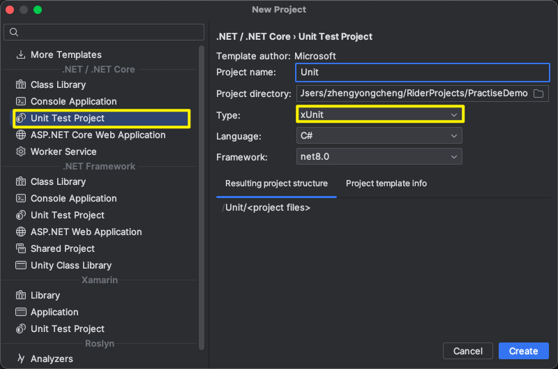

# 基概

* `xUnit.net`是一个开源的、社区驱动的单元测试工具
* 适用于单元测试`C#`、`F#`，`VB.NET`和其他`.NET`语言的最新技术

## - 类型支持

* `xUnit.net`主要支持两种不同类型的单元测试，事实`[Fact]`和理论`[Theroy]（**将特性标记在方法上即可**）
  * `[Fact]`：**用于测试不变的条件，也就是说这种测试不接受任何外部输入，代表着每次运行该类型的测试时，都是以相同方式执行并期望产生相同结果**
  * `[Theroy]`：**适用于基于相同的逻辑，但是每次执行时都会使用不同的输入数据，非常适合测试在不同条件下会产生不同行为的功能**


## - AAA

* 对于`Unit Test`的写法，一般分为三个步骤

  1. `Arrange`：**准备阶段，做一些准备工作，比如说模拟数据、初始化对象、配置测试环境等**

     ```c#
     // Arrange
     var calculator = new Calculator();
     int a = 5;
     int b = 7;
     int expected = 12;
     ```

  2. `Act`：**行为阶段，也就是用刚刚准备好的数据去调用代测试的方法**

     ```c#
     // Act
     int result = calculator.Add(a, b);
     ```

  3. `Assert`：**断定阶段，把行为阶段调用目标方法返回的值和预期值进行比较，如果一致则说明测试通过，否则为失败**

     ```c#
     // Assert
     Assert.Equal(expected, result);
     ```

* **遵循`AAA`模式确保每个测试都专注于一个特定的行为或功能点，同时也使得测试代码更容易理解和维护**

# Demo

* 以`IDE`使用`Rider`为例

1. 根据`Rider`自带的模版创建项目

   

2. 项目自动创建完后会自动引入如下依赖

   ```c#
       <ItemGroup>
           <PackageReference Include="Microsoft.NET.Test.Sdk" Version="17.6.0"/>
           <PackageReference Include="xunit" Version="2.4.2"/>
           <PackageReference Include="xunit.runner.visualstudio" Version="2.4.5">
               <IncludeAssets>runtime; build; native; contentfiles; analyzers; buildtransitive</IncludeAssets>
               <PrivateAssets>all</PrivateAssets>
           </PackageReference>
           <PackageReference Include="coverlet.collector" Version="6.0.0">
               <IncludeAssets>runtime; build; native; contentfiles; analyzers; buildtransitive</IncludeAssets>
               <PrivateAssets>all</PrivateAssets>
           </PackageReference>
       </ItemGroup>
   ```

3. 后续即可使用`[Fact]`/`[Theory]`做单元测试，如下所示

   ```c#
   namespace Unit;
   public class UnitTest1
   {
       [Fact]
       public void Test1()
       {
           // Arrange
           var calculator = new Calculator();
           int a = 5;
           int b = 7;
           int expected = 12;
   
           // Act
           int result = calculator.Add(a, b);
   
           // Assert
           Assert.Equal(expected, result);
       }
       [Theory]
       [InlineData(1,2, 3)]
       [InlineData(3,2,4)]
       [InlineData(6,9,15)]
       public void Test2(int a,int b, int expected)
       {
           var calculator = new Calculator();
           var result = calculator.Add(a, b);
           Assert.Equal(expected, result);
       }
   }
   public class Calculator
   {
       public int Add(int a, int b)
       {
           return a + b;
       }
   }
   ```

4. 运行时只要有一个测试不通过，则代表全局失败

   

# 使用

## - 跨框架

* 跨框架测试意味着我们的测试项目可以被配置为在不同版本的`.NET`框架上执行测试

* 以确保我们的项目能够在多个`.NET`环境中正常工作，并且可以帮助我们捕捉`API`因版本差异而引入的潜在问题

* 使用

  * 在项目文件`.csproj`中，通过`<TargetFrameworks>`元素(**注意这是复数，正常情况在单个`.NET`框架上测试是`<TargetFramework>`**)来指定多个目标框架

    ```c#
    <PropertyGroup>
        <TargetFrameworks>netcoreapp3.1;net5.0;net48</TargetFrameworks>
    </PropertyGroup>
    ```

  * 在测试代码底部的菜单栏中可以选中测试要运行的版本

    

* **注意：当测试是针对多个框架运行时，请确保测试代码以及包的引用在不同版本的框架之间是兼容的**


## - 异常测试

* `xUnit`提供了一种简洁有效的方式来测试方法是否抛出了预期的异常（这种测试方式也是单元测试中常见的需求）

* **通过调用`Assert.Throws<T>`(同步测试)或者`Assert.ThrowsAsync<T>`(异步测试)方法来实现异常测试--`T`为期望抛出的异常类型**

  * `Assert.Throws<T>`：接受一个返回值类型为`void`的委托作为参数（通常是一个`Lambda`表达式，表示要执行的测试代码块）

    ```c#
    [Fact]
    public void TestForArgumentNullException()
    {
        var myClass = new MyClass();
        // Act & Assert
        var exception = Assert.Throws<ArgumentNullException>(() => myClass.MyMethod(null));
        // 可以对异常进行进一步的断言
        Assert.Equal("paramName", exception.ParamName);
    }
    ```

  * `Assert.ThrowsAsync<T>`：接受一个返回值类型为`Task`的委托作为参数

    ```c#
    [Fact]
    public async Task TestForInvalidOperationExceptionAsync()
    {
        var myClass = new MyClass();
        // Act & Assert
        var exception = await Assert.ThrowsAsync<InvalidOperationException>(() => myClass.MyAsyncMethod());
        // 可以对异常进行进一步的断言
        Assert.Equal("Expected error message", exception.Message);
    }
    ```

* **当方法需在特定的条件下应该失败时，使用异常测试不仅能帮助确保方法遇到错误条件时能够正确地失败，而且还可以验证错误的类型和可能附加的信息**

* 注意

  * <b style="color:red">使用`Assert.Throws<T>`/`Assert.ThrowsAsync<T>`方法是用于断言一个特定类型的异常被抛出，也就是说抛出的异常类型正好是`T`类型，测试会通过，但是如果抛出的异常类型是`T`类型的子类，测试将不会通过--so这两种方式用于精确地断言被抛出的异常类型</b>
  * <b style="color:red">如果想要断言一个异常类型或其子类被抛出，需要通过调用`Assert.ThrowsAny<TException>`或者`Assert.ThrowsAnyAsync<T>`方法</b>


## - 数据驱动测试

* **数据驱动测试是指允许我们使用相同的方法允许多个测试用例，每个测试用例都使用不同的数据**
* `xUnit`提供了三种不同的方式来实现数据驱动测试(需配合`[Theory]`使用)
  * `[InlineData]`
  * `[MemberData]`
  * `[ClassData]`


### · `[InlineData]`

* `[InlineData]`**允许我们直接在测试方法的特性中指定特定测试数据**

* **每一个`[InlineData]`特性都代表了一个单独的测试用例，其值会被测试方法中对应位置的方法参数接受**

* 如下所示：

  ```c#
  [Theory]
  [InlineData(1, 2, 3)]
  [InlineData(2, 3, 5)]
  [InlineData(3, 5, 8)]
  public void CanAddNumbers(int a, int b, int expectedSum)
  {
      var calculator = new Calculator();
      var result = calculator.Add(a, b);
      Assert.Equal(expectedSum, result);
  }
  ```

* **这种方式使用起来很简洁，但也比较受限，因只能提供静态数据，无法直接传递对象实例或者复杂的数据结构，也无法基于运行时逻辑生成测试数据**


### · `[MemberData]`

* `[MemberData]`**特性允许我们引用类中的一个属性、字段或方法，以动态提供测试数据**

* 使用起来也很简单，只需在`[MemberData]`特性上指定一个数据源(即**返回一个`IEnumeralbe<ojbect[]>`**的属性、字段或方法)，每一个`object[]`包含了一组传递给测试方法的参数

* 如下所示：

  ```c#
  public class CalculatorTests
  {
      // 使用属性作为数据源
      public static IEnumerable<object[]> AddTestData
      {
          get
          {
              yield return new object[] { 1, 1, 2 };
              yield return new object[] { -1, -1, -2 };
              yield return new object[] { 0, 0, 0 };
          }
      }
      // 使用字段作为数据源
      public static IEnumerable<object[]> AddTestDataField = new List<object[]>
      {
          new object[] { 3, 5, 8 },
          new object[] { -2, -2, -4 },
          new object[] { int.MaxValue, -1, int.MaxValue - 1 }
      };
  		// 使用方法作为数据源
      public static IEnumerable<object[]> GetAddTestData()
      {
          yield return new object[] { 1, 2, 3 };
          yield return new object[] { -1, -1, -2 };
          yield return new object[] { 0, 0, 0 };
      }
  
      [Theory]
     	// 可以多次使用`[MemberData]`来引入不用数据源的测试数据
      [MemberData(nameof(AddTestData))]
      [MemberData(nameof(AddTestDataField))]
      [MemberData(nameof(GetAddTestData))]
      public void AddTest(int a, int b, int expected)
      {
          var calculator = new Calculator();
          var result = calculator.Add(a, b);
          Assert.Equal(expected, result);
      }
  }
  ```

* 注意：

  * **数据源(属性、字段、方法)必须是`static`修饰的**
  * **当使用方法作为数据源时，该方法不能有参数**(否则会报异常`System.NotSupportedException: Specified method is not supported.`)

* **如果数据源定义在别的类，需在`[MemberData]`特性上指定`MemberType`的值，用于表明数据源出于哪个类中，并且此时数据源须用`public`修饰，确保是可见的（如果在同一程序集中，也可以用`internal`修饰）**

  ```c#
  public class TestData
  {
      public static IEnumerable<object[]> AddTestData
      {
          get
          {
              yield return new object[] { 1, 2, 3 };
              yield return new object[] { 4, 5, 9 };
          }
      }
  }
  public class CalculatorTests
  {
      [Theory]
      [MemberData(nameof(TestData.AddTestData), MemberType = typeof(TestData))]
      public void AddTest(int a, int b, int expected)
      {
          var calculator = new Calculator();
          var result = calculator.Add(a, b);
          Assert.Equal(expected, result);
      }
  }
  ```

  

### · `[ClassData]`

* `[ClassData]`**允许我们通过指定一个实现了`IEnumerable<object[]>`接口的类来提供测试数据**

* 它是在类的层面上来定义数据源，这对于处理更为复杂的测试数据场景特别适用

* 使用步骤

  1. 定义一个实现了`IEnumerable<object[]>`接口的类，并生成测试数据

     ```c#
     public class CalculatorTestData : IEnumerable<object[]>
     {
         public IEnumerator<object[]> GetEnumerator()
         {
             yield return new object[] { 1, 2, 3 };  
             yield return new object[] { -1, -1, -2 }; 
             yield return new object[] { 0, 0, 0 };  
         }
         IEnumerator IEnumerable.GetEnumerator()
         {
             return GetEnumerator();
         }
     }
     ```

  2. 在测试方法通过`[ClassData]`特性引入测试数据

     ```c#
     public class CalculatorTests
     {
         [Theory]
         [ClassData(typeof(CalculatorTestData))]
         public void AddTest(int a, int b, int expected)
         {
             var calculator = new Calculator();
             var result = calculator.Add(a, b);
             Assert.Equal(expected, result);
         }
     }
     ```

* **注意：数据类须具有无参构造（`xUnit是通过反射来创建该数据类实例的`），还必须实现`IEnumeralbe<object[]>`接口**


## - 输出测试信息

* 若想在测试方法中输出一些测试信息，使用`Console.WriteLine`是没有效果的

* 需使用`ITestOutputHelper`才可以

* 使用

  ```c#
  public class UnitTest1
  {
  
      private readonly ITestOutputHelper _testOutputHelper;
  
      public UnitTest1(ITestOutputHelper testOutputHelper)
      {
          _testOutputHelper = testOutputHelper;
      }
      
      [Theory]
      [ClassData(typeof(CalculatorTestData))]
      public void CanAddNumbers(int a, int b, int expectedSum)
      {
          _testOutputHelper.WriteLine("开始");
          var calculator = new Calculator();
          var result = calculator.Add(a, b);
          Assert.Equal(expectedSum, result);
      }
  }
  ```

  


## - 跳过测试用例

* 当某些测试暂时不适合运行时，`xUnit`提供了简单的机制来跳过单个测试用例

* 用法很简单，**只需要在`[Fact]`/`[Theory]`特性上使用参数`Skip`，并提供一个字符串作为跳过测试的原因即可**

  ```c#
  	[Theory(Skip = "don't have enviroment")]
      [ClassData(typeof(CalculatorTestData))]
      public void CanAddNumbers2(int a, int b, int expectedSum)
      {
          var calculator = new Calculator();
          var result = calculator.Add(a, b);
          Assert.Equal(expectedSum, result);
      }
  ```

  

* 如果想跳过这个测试类的测试，`xUnit`并没有直接的机制来通过一个属性或特性来实现此功能

* 因此此功能的实现需要拐个弯才行

* 比如说可以通过条件编译指令来实现，如下所示

  ```c#
  #define SKIP_TESTS
  
  using System;
  
  // 其他 using 指令...
  
  #if !SKIP_TESTS
  public class ConditionalTestsToSkip
  {
      // 测试方法...
  }
  #endif
  ```
  


## - 更改测试用例名称

* 在`xUnit`中，**测试用例名称默认是基于测试方法的名称生成的**

* **如果想要自定义或更改测试用例的名称，可以通过`[Fact]`/`[Theory]`的`DisplayName`属性来指定**

* 如下所示：

  ```c#
  public class UnitTest1    
  {
  		[Theory(DisplayName = "CustomName_For_AddNumber")]
      [ClassData(typeof(CalculatorTestData))]
      public void CanAddNumbers(int a, int b, int expectedSum)
      {
          var calculator = new Calculator();
          var result = calculator.Add(a, b);
          Assert.Equal(expectedSum, result);
      }
  }
  ```

  实际运行结果

  


## - 分组查看测试用例

* **实际上，可以通过`[Trait]`特性来为测试用例添加元数据，但其本身并不直接改变测试用例的名称**

* **这些元数据可以帮助我们在`IDE`查看时进行一个类别划分**

* 使用：

  * `[Trait]`特性需要提供一个`key`和`value`

    * **`key`用来指定类别，常见的包括`Category`、`Priority`、`Bug`等**
    * **`value`可以是任何字符串，用于进一步描述或分类测试**

  * 如下所示：

    ```c#
    		[Theory()]
        [Trait("Category", "CustomName_T1")]
        [ClassData(typeof(CalculatorTestData))]
        public void CanAddNumbers(int a, int b, int expectedSum)
        {
            var calculator = new Calculator();
            var result = calculator.Add(a, b);
            Assert.Equal(expectedSum, result);
        }
    		[Theory()]
        [Trait("Category", "CustomName_T2")]
        [ClassData(typeof(CalculatorTestData))]
        public void CanAddNumbers2(int a, int b, int expectedSum)
        {
            var calculator = new Calculator();
            var result = calculator.Add(a, b);
            Assert.Equal(expectedSum, result);
        }
    ```

  * 那么在运行测试后，通过`IDE`的展示选项我们可以进行过滤操作

    

    

## - `BeforeAfterTestAttribute`

* 这是`xUnit`的一个特性，其作用见名思义，**它允许我们在每个测试方法执行之前和之后执行自定义的代码**

* **其应用场景用于设置测试前的条件或清理测试后的状态特别有用**

* 使用

  1. 创建一个继承`BeforeAfterTestAttribute`的类

  2. 重写`Before()`和`After()`,完成测试之前和测试之后应执行的代码

     ```c#
     public class DatabaseCleanupAttribute : BeforeAfterTestAttribute
     {
         public override void Before(MethodInfo methodUnderTest)
         {
             // 在每个测试方法执行前执行的代码
             // 例如：初始化数据库状态、清理测试数据等
         }
     
         public override void After(MethodInfo methodUnderTest)
         {
             // 在每个测试方法执行后执行的代码
             // 例如：清理数据库、回滚事务等
         }
     }
     ```

     * **`MethodInfo`参数表示当前正在执行的测试方法，这可以让我们根据测试方法的特定信息来调整前置和后置操作的行为**

  3. 后续即可使用此属性作用在测试方法或者测试类上(**标识在测试类上时，表示对该测试类的所有测试方法都生效**)

     ```c#
     [DatabaseCleanup]
     public class MyDatabaseTests
     {
         [Fact]
         public void Test1()
         {
             // 测试代码
         }
         [Fact]
         public void Test2()
         {
             // 测试代码
         }
     }
     ```

* **注意：**
  * **使用`BeforeAfterTestAttribute`时，请确保`Before()`中设置的任何状态在`After()`中被适当的清理或重置**
  * 将继承自`BeforeAfterTestAttribute`的特性标识在一个测试类上时，**它的`Before()`和`After()`将在该测试类中的每个测试方法执行前后分别执行一遍**（也就是说假设该测试类有n个测试方法，那么就会执行n遍`Before()`和n遍`After()`），**这种行为用来确保每个测试方法都能在一个已知的环境中运行，即每次测试都是独立的，不会因为前一个测试所造成的状态改变而受到影响**


## - `IDisposable`&`IClassFixture<T>`

* 上述的`BeforeAfterTestAttribute`适用于针对每一个测试方法，都会执行一遍`Before()`和`After()`

* 那有没有什么方式，是针对测试类的所有测试方法执行前先执行一遍统一的初始化动作，执行完所有的测试方法后再调用一个统一清理操作呢

* 有的，这就是本节的`IDisposable` & `IClassFixture<T>`的配合使用了

  * **`IClassFixture<T>`用于为整个测试类提供相同的实例(即`fixture`)，这个实例在测试类的所有测试方法执行前创建，并在所有测试方法执行完成后释放**
  * **而当`fixture`类实现了`IDisposable`接口时，`xUnit`会在测试类的所有测试方法执行完成之后自动调用`Dispose()`**

* 因此不妨构思一下

* <b style="color:red">我们定义的`fixture`类实现`IDisposable`接口，在`fixture`的无参构造函数中做一个统一的初始化操作，重写`IDisposable`接口中的`Dispose()`方法，在里面完成一些统一的销毁操作，这样就达到我们的目的了</b>

* 使用：

  1. 自定实现了`IDisposable`接口的`fixture`类

     ```c#
     public class DatabaseFixture : IDisposable
     {
         public DbConnection Connection { get; private set; }
         public DatabaseFixture()
         {
             // 初始化数据库连接
             Connection = new SqlConnection("YourConnectionString");
             Connection.Open();
         }
         public void Dispose()
         {
             // 清理资源
             Connection.Close();
         }
     }
     ```

  2. 使用

     ```c#
     public class MyDatabaseTests : IClassFixture<DatabaseFixture>
     {
         private readonly DatabaseFixture fixture;
         public MyDatabaseTests(DatabaseFixture fixture)
         {
             this.fixture = fixture;
         }
         [Fact]
         public void Test1()
         {
             // 使用 fixture.Connection 进行测试
         }
         [Fact]
         public void Test2()
         {
             // 使用 fixture.Connection 进行另一个测试
         }
     }
     ```

     * <b style="color:red">将自定义的`fixture`注入到测试类中并不是必须的，但这是个通常性操作，因为测试方法中可能需要用到`fixture`中的资源或数据</b>

  * 实际上，也可以直接让测试类继承`IDisposable`接口，在其无参构造函数中定义统一的初始化动作，在重写的`Dispose()`编写统一的清理动作，这种方式一与`IDisposable`和`IClassFixture<T>`结合的方式二相比，通用型要稍微差一些，毕竟方式二可以用在多个测试类上，而方式一只能适用于当前类


## - `ICollectionFixture <T>`

* `ICollectionFixture<T>`是`xUnit`中**用于多个测试类之间共享上下文的机制**

* **通过使用`ICollectionFixture<T>`，我们可以在一个测试集合内的所有测试类之间共享一个或多个初始化代码和清理代码，避免重复的设置和清理逻辑**

* 使用：

  1. 定义`fixture`类

     ```c#
     public class DatabaseFixture : IDisposable
     {
        //定义共享资源 
       
         public DatabaseFixture()
         {
             // 初始化数据库连接--初始化动作
         }
         public void Dispose()
         {
             // 清理数据库连接--清理动作
         }
     }
     ```

  2. 定义测试集合

     ```c#
     [CollectionDefinition("Database collection")]
     public class DatabaseCollection : ICollectionFixture<DatabaseFixture>
     {
         // 这个类没有实现代码，它的存在仅用于附加集合元数据到测试集合
     }
     ```

  3. 将测试类关联到测试集合

     ```c#
     [Collection("Database collection")]
     public class DatabaseTests1
     {
       // 如果有想要用到`DatabaseFixture`实例，可以直接通过注入的方式进行引入
         private readonly DatabaseFixture _databaseFixture;
         public DatabaseTests1(DatabaseFixture databaseFixture)
         {
           _databaseFixture = databseFixture;
         }
     }
     
     [Collection("Database collection")]
     public class DatabaseTests2
     {
         // 这个测试类也可以使用 DatabaseFixture 中的资源，和 DatabaseTests1 共享同一个 DatabaseFixture 实例
     }
     ```

* 其应用场景在于对于一些共享性的昂贵资源的初始化，比如说建立数据库连接，又或者说多个测试类中需要操作共同的测试数据集，使用`ICollectionFixture<T>`就非常适合

# 注意事项

* 在`xUnit`中，**测试类不需要通过特定的属性(如`[TestClass]`)来进行标明**，它识别测试类的方式与一些其他的框架不同，**任何公开的类都可以包含测试方法（也就是说`xUnit提供的是方法级别而非类级别的特性来进行测试`）**，前提是这些方法需满足以下这些条件

  * **方法是`public`修饰的**
  * **方法返回`void`(同步测试)或`Task`(异步测试)**
  * **方法被`[Fact]`或`[Theory]`等特性标记**

* `IClassFixture<T>`和`ICollecionFixture<T>`区别

  |              |        IClassFixture<T>        |                ICollectionFixutre<T>                 |
  | :----------: | :----------------------------: | :--------------------------------------------------: |
  |   应用范围   |      **适用于单个测试类**      |                 **适用于多个测试类**                 |
  |   共享级别   | **在单个测试类中实现资源共享** |      **在测试集合的多个测试类之间实现资源共享**      |
  | 生命周期管理 | **与单个测试类的生命周期绑定** | **与测试集合的生命周期绑定<br />跨越集合内的测试类** |

* **假设在多个测试类中分别使用`IClassFixture<T>`来引用同一个`fixture`类型的`T`**（为后续便于描述，这个操作叫方式A）时

  * 此时表面上好像实现了`ICollectionFixture<T>`的效果，其实不然
  * **方式A中尽管多个测试类引用了同一个`fixture`类型，但实际运行时`xUnit`会为每个测试类都生成一个对应的`fixture`实例**
  * **这些实例之间是相互独立的，也就是说它们之间不回共享任何状态，自个管自个的，各自的生命周期也是跟着对应的测试类走**
  * **因此也无法达到使用`ICollectionFixture<T>`时可以在多个测试类之间共享`fixture`实例的效果**
  * **但是也正是因为这些实例之间相互独立的原由，为每个测试类也提供了更好的隔离性，因为每个类都有专属于自己的`fixture`实例，so这些测试类之间不会因为共享相同的资源实例而互相影响**

