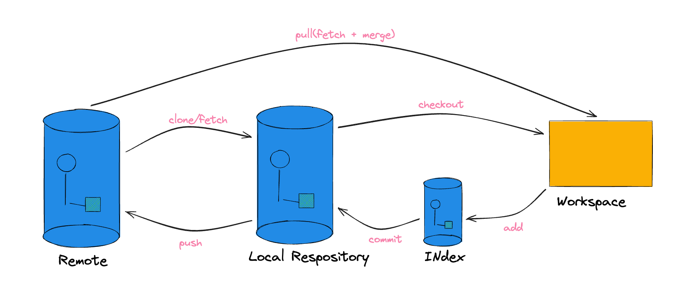
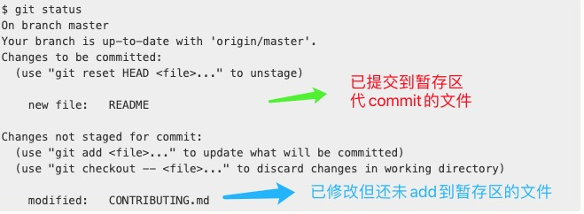

## 基础概念

* 基础概念

  * 官方描述：是一种记录一个文件或一组文件随时间变化的系统

  * 大白话版：在任意时刻可以给某些文件做一个快照操作，以达到在时间轴上可以随意切换这些文件的不同版本的目的

* 优势
  * 保证完整性：所有的数据在存储前`Git`都会计算校验和，也就意味着不可能在`Git`不知情时更改任何内容或目录内容
  * 操作本地化：本地磁盘上就存有项目的完整历史，在`Git`中的绝大数操作都只需要访问本地文件和资源
  
* `Git`的工作流程图
  
  

## 常用命令

### - 初始化仓库

* 将尚未进行版本控制的本地目录转化为`Git`仓库

  1. 进入到某个目录：`cd xxxxxx`
  2. 初始化：`git init`

* 从某个服务器上克隆一个已存在的`Git`仓库（<b style="color:red">默认配置下远程`Git`仓库的每一个文件的每一个版本都将会被拉取下来</b>）

  * 直接克隆远程仓库：`git clone 远程仓库url`（新建的本地目录名会与远程仓库名一致）

    > 如果说想要本地目录名自定义的话，可以通过指定额外的参数来实现：`git clone 远程仓库url 本地目录名`

ps：仓库初始化后，会自动生成一个`.git`的隐藏子目录，这个子目录含有初始化`Git`中所有的必须文件

### - 文件操作

* 文件状态区分

  * 已跟踪：指被纳入了版本控制的文件，在上一次快照中有它们的记录，在工作一段时间后，它们的状态可能是为修改，已修改或以放入暂存区（简而言之，<b style="color:red">已跟踪文件就是`Git`已经知道的文件</b>）

  * 未跟踪：除已跟踪文件外的所有文件。(在仓库进行快照后，新增的文件且未`add`到暂存区的就是未跟踪文件)

  

* 检查当前文件状态：`git status`

  

* 跟踪新文件/暂存已修改文件：`git add 文件名/目录`

  > * 适用于那些**新增还未跟踪的文件**或者**做了修改操作的已跟踪文件**
  > * 通常使用`git add .`一次性把所有文件交到暂存区去

* 忽略文件：

  * 概念：一些文件无需纳入`Git`管理，并且也不希望它们总出现在为跟踪文件列表

  * 实现：在仓库中新建名为`.gitignore`文件，并在此文件中配置

  * 文件`.gitignore`的格式规范如下

    * 所有空行或者以 `#` 开头的行都会被 Git 忽略。
    * 可以使用标准的 glob 模式（`shell`所使用的简化了的郑泽表达式）匹配，它会递归地应用在整个工作区中。
    * 匹配模式可以以（`/`）开头防止递归。
    * 匹配模式可以以（`/`）结尾指定目录。
    * 要忽略指定模式以外的文件或目录，可以在模式前加上叹号（`!`）取反。

    > * 正常情况下一个仓库可能只在跟目录下有一个`.gitignore`文件，它递归地应用到整个仓库中
    > * 然而，子目录下也可以有额外的`.gitignore`文件
    > * 子目录中的`.gitignore`文件中的规则只作用在它所在的目录中

* 提交更新：`git commit -m "提交信息"`
  * **提交时记录的是暂存区的快照**
  * 举个case：假设现在有个文件A，做了修改后`add` ,那么此时暂存区和工作区的文件A都处于Version-1，就在这时，我又去更改了文件A，此时文件A在工作区处于Version-2，而在暂存区中处于Version-1，现在`commit`的话，是把暂存区的Version-1提交上去

* 移除文件（分两种情况）--只针对已跟踪文件

  * 即要取消文件被`Git`管理，也要实际删除此文件
    1. 删除文件：从本地删除文件
    2. `git rm 文件名`：将文件从`git`管理中删除掉（如果此文件之前修改过且已经放到暂存区的，则必须使用`-f`强制删除选项）

  * 只取消文件被`Git`管理（相当于想让文件留在磁盘，但是不想让`Git`继续跟踪）
    * `git rm --cached 文件名/目录/glob模式匹配`

* 移动文件：`git mv file_from file_to`
  * 实际上，`git`会运行下面这几条命令
    1. `mv file_from file_to`
    2. `git rm file_from`
    3. `git add file_to`

* 查看提交历史：`git log`

  * 下面列举出一些常用的选项

    |       选项        |                             说明                             |
    | :---------------: | :----------------------------------------------------------: |
    |     `--stat`      |               显示每次提交的文件修改统计信息。               |
    |   `--shortstat`   |         只显示 --stat 中最后的行数修改添加移除统计。         |
    |   `--name-only`   |             仅在提交信息后显示已修改的文件清单。             |
    |  `--name-status`  |               显示新增、修改、删除的文件清单。               |
    | `--abbrev-commit` |      仅显示 SHA-1 校验和所有 40 个字符中的前几个字符。       |
    | `--relative-date` | 使用较短的相对时间而不是完整格式显示日期（比如“2 weeks ago”）。 |
    |     `--graph`     |          在日志旁以 ASCII 图形显示分支与合并历史。           |
    |    `--pretty`     | 使用其他格式显示历史提交信息。可用的选项包括 oneline、short、full、fuller 和 format（用来定义自己的格式）。 |
    |       `-p`        |              按补丁格式显示每个提交引入的差异。              |

    

### - 使用远程仓库

* 添加远程仓库（有两种方式）
  * `git clone 远程仓库url`
  * `git remote add 远程仓库名简写 远程仓库url`
    * 后续操作可以使用这个简写代替整个`url`

* 查看远程仓库：`git remote`
  * 克隆的仓库服务器默认名字为`origin`
  * 命令可以带`-v` 选项来查看远程仓库的简写以及对应`url`

* 从远程仓库中抓取与拉取
  * `git fetch <remote>`
    * 此命令的含义是会从远程仓库中拉最新的数据到本地
    * <b style="color:red">注意，`fetch`是不会自动合并或修改你当前的工作，所以必须自己手动合并</b>
  * `git pull`
    * 前提：当前分支设置了跟踪远程分支
    * `pull`抓取最新数据后会自动合并到当前分支

* 推送到远程仓库：`git push 远程仓库url/其简写 分支名`
  * 必须具有目标服务器的写入权限，并且之前没有人推送过

* 重命名远程仓库的简写名：`git remote remove 原始仓库名 新仓库名`

### - 分支操作

* 分支创建：`git branch 新分支名`

* 分支切换：`git checkout 代切换分支名`
  * 创建并直接切换到新分支的话，直接带个`-b`选项就好，如`git checkout -b 新分支名`
* 分支合并：`git merge 代合并分支名`
  * <b style="color:red">这个把目标分支合并到当前分支</b>
* 分支删除：`git branch -d 分支名`
* 产看分支列表：`git branch`